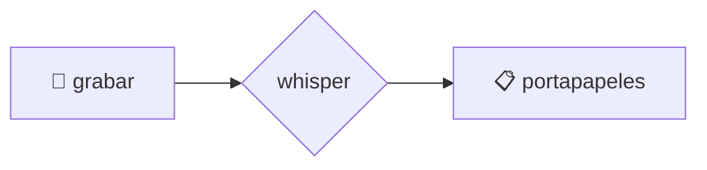
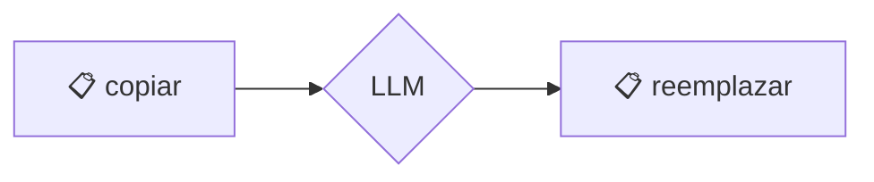

# 🗣️ voice2machine (v2m-lab)

Fuente de verdad interna y núcleo upstream para Voice2Machine.

_dictado por voz para cualquier campo de texto de tu sistema operativo_

---

## qué es esto

Una herramienta que convierte tu voz en texto usando tu GPU local.

La premisa es simple: hablar es más rápido que escribir. Este proyecto te deja dictar en cualquier aplicación sin depender de servicios en la nube.

---

## filosofía

- **local-first**: tu audio no sale de tu máquina
- **modular**: empezó como un script, ahora es una app con responsabilidades separadas
- **gpu-powered**: velocidad de transcripción usando WHISPER localmente

---

## cómo funciona

Dos atajos de teclado globales:

| script          | función                                                        |
| --------------- | -------------------------------------------------------------- |
| `v2m-toggle.sh` | graba → transcribe → copia al portapapeles                     |
| `v2m-llm.sh`    | toma texto del portapapeles → lo refina con LLM → lo reemplaza |

---

## documentación

Toda la info técnica está en `/docs` (consolidada en español):

- [instalación](docs/es/instalacion.md)
- [arquitectura](docs/es/arquitectura.md)
- [configuración](docs/es/configuracion.md)
- [atajos de teclado](docs/es/atajos_teclado.md) ⌨️
- [solución de problemas](docs/es/troubleshooting.md)

---

## flujos visuales

### voz → texto

### texto → texto mejorado

> si no ves los diagramas, necesitas una extensión de mermaid

---

## licencia

Este proyecto está licenciado bajo la **GNU General Public License v3.0** - ver el archivo [LICENSE](LICENSE) para más detalles.
