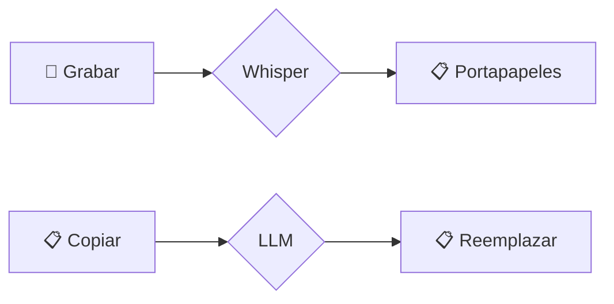

# 🗣️ voice2machine

_dictado por voz para cualquier campo de texto en tu SO_

---

[🇺🇸 English](README.md) | [🇪🇸 Español](LEEME.md)

---

## qué es esto

Una herramienta que convierte tu voz a texto utilizando tu GPU local.

La premisa es simple: hablar es más rápido que escribir. Este proyecto te permite dictar en cualquier aplicación sin depender de servicios en la nube.

## filosofía

- **local-first**: tu audio nunca sale de tu máquina
- **modular**: responsabilidades separadas (daemon, api, clientes)
- **impulsado por gpu**: velocidad de transcripción usando WHISPER localmente

## documentación

**[📚 Leer la Documentación Completa](https://zarvent.github.io/voice2machine/)**

Todo lo que necesitas saber está ahí:
* Instalación y Configuración
* Arquitectura y API
* Solución de problemas

## cómo funciona

El sistema se ejecuta como un **Demonio en Segundo Plano** que expone una **API REST FastAPI** en `localhost:8765`.

## licencia

Este proyecto está licenciado bajo la **GNU General Public License v3.0** - mira el archivo [LICENSE](LICENSE) para más detalles.
