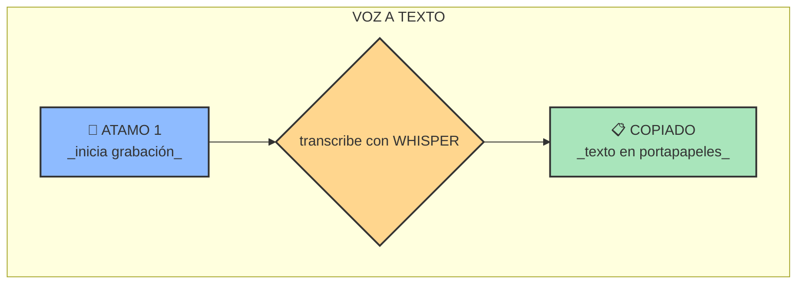
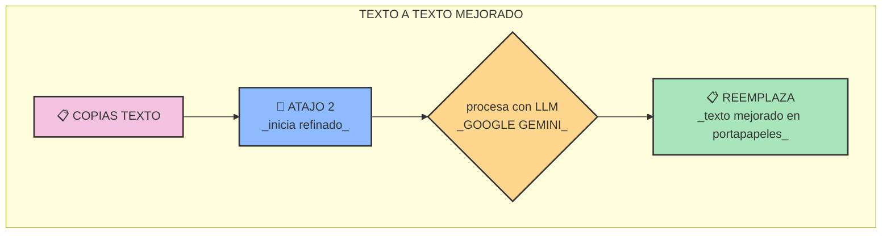

# 🗣️ HERRAMIENTA DE DICTADO POR VOZ

_una herramienta de dictado por voz para transcribir audio en cualquier campo de texto del sistema operativo_

---

### 📚 DOCUMENTACIÓN COMPLETA

> **toda la documentación detallada se encuentra en la carpeta `/docs`**
>
> explora la guía de instalación la arquitectura y más navegando en esa carpeta

---

## 🎯 PROPÓSITO

el objetivo es simple

> poder dictar texto en cualquier lugar del sistema operativo

la idea es transcribir audio con una GPU para máxima velocidad sin importar la aplicación que estés usando

este proyecto es una refactorización de un script simple a una aplicación modular en PYTHON para separar responsabilidades y facilitar el mantenimiento a futuro

---

## 🕹️ FLUJO DE TRABAJO

la interacción tiene dos funciones principales activadas por atajos de teclado globales para no interrumpir tu trabajo

#### 1. FLUJO DE DICTADO (VOZ → TEXTO)

este es el flujo principal para capturar tu voz y convertirla en texto se activa con `scripts/whisper-toggle.sh`



#### 2. FLUJO DE REFINADO (TEXTO → TEXTO MEJORADO)

a veces la transcripción no es perfecta este flujo toma el texto de tu portapapeles y usa un LLM para limpiarlo corregirlo o formatearlo se activa con `scripts/process-clipboard.sh`


---

## 🛠️ DESARROLLO Y QUALITY ASSURANCE

### Tests y Validación
```bash
# Ejecutar tests unitarios
make test

# Validación QA completa (complejidad, dead code, tipos, tests)
make qa-full

# Validación QA rápida (pre-commit)
make qa-quick
```

### Herramientas QA Incluidas
- **Radon**: Análisis de complejidad ciclomática
- **Vulture**: Detección de código muerto
- **MyPy**: Verificación de tipado estático
- **Pytest**: Framework de testing con 18+ tests

Para más detalles sobre las mejoras de QA implementadas, ver [`docs/QA_IMPLEMENTATION.md`](docs/QA_IMPLEMENTATION.md)

---

> _**nota sobre la visualización** si los diagramas de flujo no se muestran en tu editor asegúrate de tener instalada una extensión compatible con mermaid_
