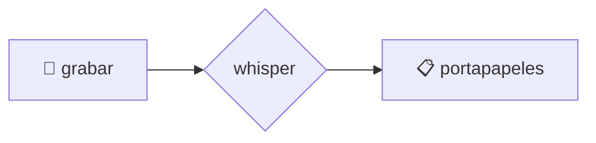
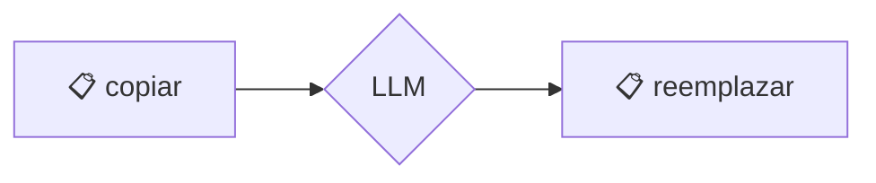

# 🗣️ voice2machine

*dictado por voz para cualquier campo de texto de tu sistema operativo*

---

## qué es esto

una herramienta que convierte tu voz en texto usando tu GPU local.

la premisa es simple: hablar es más rápido que escribir. este proyecto te deja dictar en cualquier aplicación sin depender de servicios en la nube.

---

## filosofía

- **local-first**: tu audio no sale de tu máquina
- **modular**: empezó como un script, ahora es una app con responsabilidades separadas
- **gpu-powered**: velocidad de transcripción usando WHISPER localmente

---

## cómo funciona

dos atajos de teclado globales:

| atajo | función |
|-------|---------|
| `scripts/whisper-toggle.sh` | graba → transcribe → copia al portapapeles |
| `scripts/process-clipboard.sh` | toma texto del portapapeles → lo refina con LLM → lo reemplaza |

---

## documentación

toda la info técnica está en `/docs`:

- [instalación](docs/instalacion.md)
- [arquitectura](docs/arquitectura.md)
- [configuración](docs/configuracion.md)
- [troubleshooting](docs/troubleshooting.md)

---

## flujos visuales

### voz → texto

### texto → texto mejorado

> si no ves los diagramas, necesitas una extensión de mermaid

---

## licencia

este proyecto está licenciado bajo la **GNU General Public License v3.0** - ver el archivo [LICENSE](LICENSE) para más detalles.