# 🗣️ voice2machine
_voice dictation for any text field in your OS_

---

## what is this

A tool that converts your voice to text using your local GPU.

The premise is simple: speaking is faster than typing. This project allows you to dictate in any application without depending on cloud services.

---

## philosophy

- **local-first**: your audio never leaves your machine
- **modular**: started as a script, now it's an app with separated responsibilities
- **gpu-powered**: transcription speed using WHISPER locally

---

## how it works

Two global keyboard shortcuts:

| script          | function                                                        |
| --------------- | --------------------------------------------------------------- |
| `v2m-toggle.sh` | records → transcribes → copies to clipboard                     |
| `v2m-llm.sh`    | takes text from clipboard → refines it with LLM → replaces it   |

---

## documentation

All technical info is in `/docs` (consolidated in Spanish):

- [installation](docs/es/instalacion.md)
- [architecture](docs/es/arquitectura.md)
- [configuration](docs/es/configuracion.md)
- [keyboard shortcuts](docs/es/atajos_teclado.md) ⌨️
- [troubleshooting](docs/es/troubleshooting.md)

---

## visual flows

### voice → text

```mermaid
flowchart LR
A[🎤 record] --> B{whisper}
B --> C[📋 clipboard]
```

### text → improved text

```mermaid
flowchart LR
A[📋 copy] --> B{LLM}
B --> C[📋 replace]
```

> if you don't see the diagrams, you need a mermaid extension

---

## license

This project is licensed under the **GNU General Public License v3.0** - see the [LICENSE](LICENSE) file for more details.
