# 🗣️ voice2machine

_voice dictation for any text field in your OS_

---

[🇺🇸 English](README.md) | [🇪🇸 Español](LEEME.md)

---

## what is this

A tool that converts your voice to text using your local GPU.

The premise is simple: speaking is faster than typing. This project allows you to dictate in any application without depending on cloud services.

## philosophy

- **local-first**: your audio never leaves your machine
- **modular**: separated responsibilities (daemon, api, clients)
- **gpu-powered**: transcription speed using WHISPER locally

## documentation

**[📚 Read the Full Documentation](https://zarvent.github.io/voice2machine/)**

Everything you need to know is there:
* Installation & Setup
* Configuration
* Architecture & API

## how it works

The system runs as a **Background Daemon** that exposes a **FastAPI REST API** on `localhost:8765`.

```mermaid
flowchart LR
    A[🎤 Record] --> B{Whisper} --> C[📋 Clipboard]
    D[📋 Copy] --> E{LLM} --> F[📋 Replace]
```

## license

This project is licensed under the **GNU General Public License v3.0** - see the [LICENSE](LICENSE) file for more details.
