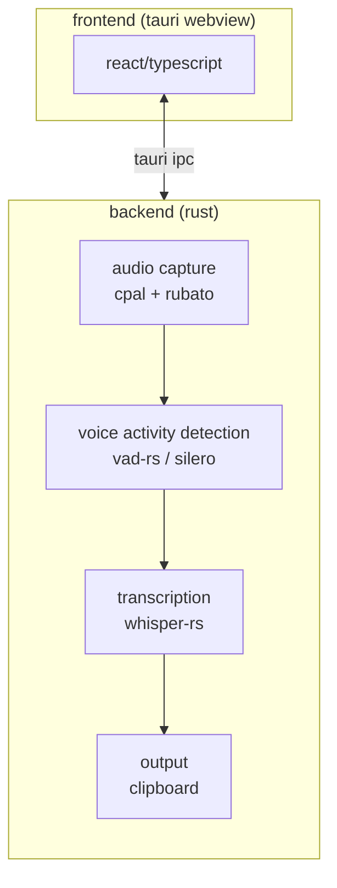

## overview

`capture` es una app de voice2machine ubicada en `voice2machine/apps/capture`

voice2machine es un monorepo que contiene herramientas de transcripcion a texto

---

## proposito

capture se centrara 100% en una sola cosa: **transcribir el input que se le asigne**

### principios

- simplicidad
- performance
- eficiencia

---

## arquitectura

### stack overview



### capas del sistema

| capa | responsabilidad | tecnologia |
| --- | --- | --- |
| ui | configuracion y feedback visual | react + typescript |
| shell | ventana, tray, shortcuts globales | tauri 2.0 |
| audio | captura y resampling (16khz mono) | cpal + rubato |
| vad | filtrar silencio antes de whisper | vad-rs (silero) |
| stt | transcripcion | whisper-rs → whisper.cpp |
| output | copiar al clipboard | arboard / clipboard-rs |

---

## pipeline de audio

### flujo completo

```mermaid
flowchart LR
A[🎤 record] --> B[VAD] --> C{whisper}
C --> D[📋 clipboard]
```



una vez ejecutado un shortcut que inicializa la transcripcion, el mismo shortcut detiene la grabacion

### vad (voice activity detection)

**¿por que vad antes de whisper?**

- filtra silencio y ruido antes de procesar
- reduce carga en whisper (solo procesa audio con voz real)
- mejora latencia percibida
- menor consumo de recursos

**libreria:** `vad-rs` (wrapper de silero vad)

- silero es un modelo ligero (~2mb) y rapido
- funciona en cpu sin problema
- detecta voz en chunks de audio en tiempo real

---

## decisiones tecnicas

### ¿por que whisper-rs?

whisper-rs **no reimplementa whisper**. es un binding ffi hacia whisper.cpp

```
tu codigo rust
     ↓
whisper-rs (bindings ffi)
     ↓
whisper.cpp (c++ compilado)
     ↓
modelo whisper (.ggml)
```

**lo que heredamos de whisper.cpp:**

- soporte gpu (metal, vulkan, cuda, opencl)
- todos los modelos (tiny → large-v3-turbo)
- optimizaciones simd (avx, neon)
- actualizaciones del proyecto principal (65k+ stars)

**¿por que no alternativas?**

- whisper-rs es mas maduro (934 stars vs 79)
- mejor documentado
- para un flujo simple (audio → whisper → clipboard) no necesitamos abstraccion extra

[whisper-rs](https://codeberg.org/tazz4843/whisper-rs)

### ¿por que large-v3-turbo?

- 8x mas rapido que large-v3
- precision casi identica para speech normal
- ~6gb vram (vs ~10gb de large-v3)

### aceleracion gpu por plataforma

| plataforma | aceleracion |
| --- | --- |
| macos | metal |
| windows | vulkan / cuda |
| linux | openblas + vulkan |

---

## modelos soportados

| fase | modelo | runtime |
| --- | --- | --- |
| mvp | whisper large-v3-turbo | local |
| futuro | whisper (cualquier version) | local + cloud via api key |
| futuro lejano | canary-1b (nvidia), granite 3.3 (ibm) | multimodal |

---

## frontend

### proposito

funcionara como un "control remoto" del backend. su principal funcion es hacer mas comoda la configuracion

### tech stack

- tauri 2.0
- react + typescript

[What is Tauri?](https://v2.tauri.app/start/)

### configuraciones disponibles

- modelo a usar
- modo: local o cloud (via api key)
- dispositivo de audio (mic)
- shortcut personalizado

---
