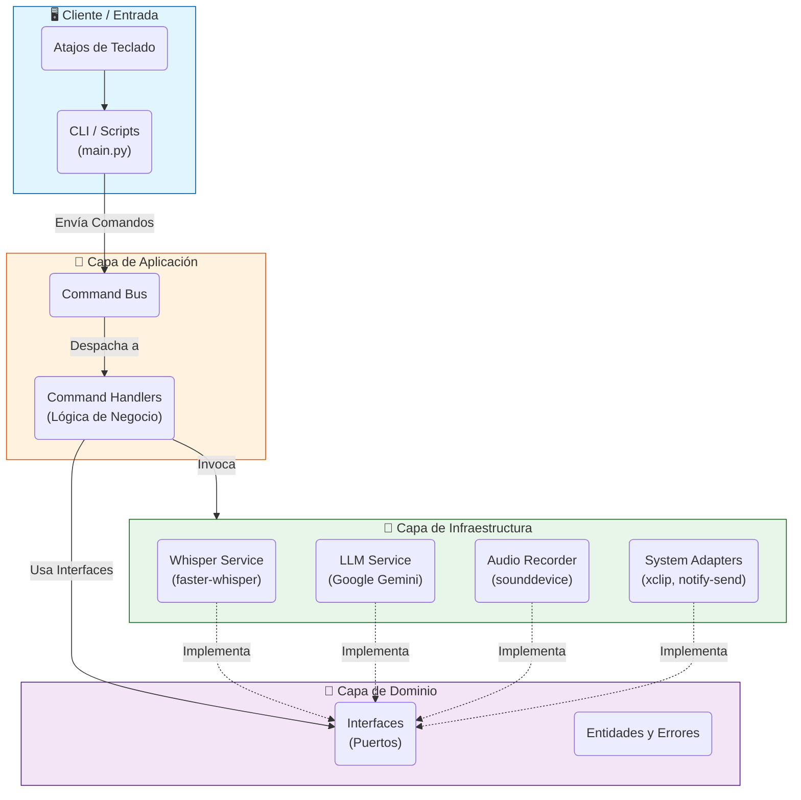

# 🧩 Arquitectura del Sistema

**Voice2Machine** está diseñado siguiendo principios de **Arquitectura Hexagonal (Puertos y Adaptadores)** y **CQRS (Command Query Responsibility Segregation)**. Esto asegura un bajo acoplamiento entre la lógica de negocio y los detalles de infraestructura (como la librería de audio o el proveedor de LLM).

---

## Diagrama de Alto Nivel

El siguiente diagrama ilustra el flujo de datos y la separación de responsabilidades entre las capas del sistema.

---

## Componentes Principales

### 1. Capa de Entrada (Client)
Es el punto de entrada al sistema. No contiene lógica de negocio, solo se encarga de recibir la intención del usuario y convertirla en un **Comando**.
*   **`main.py`**: Actúa como el controlador principal. Puede ejecutarse en modo *Daemon* (servidor persistente) o *Client* (envío de comandos efímeros).
*   **Scripts Bash**: Scripts ligeros (`whisper-toggle.sh`, `process-clipboard.sh`) que sirven como puente entre los atajos del sistema operativo y la aplicación Python.

### 2. Capa de Aplicación (Application)
Coordina las acciones del sistema.
*   **Command Bus**: Recibe comandos (ej. `StartRecordingCommand`) y los enruta al manejador correspondiente.
*   **Command Handlers**: Ejecutan la lógica específica (ej. `StartRecordingHandler` inicia el servicio de audio y notifica al usuario).

### 3. Capa de Dominio (Domain)
Define las reglas y contratos del sistema. Es agnóstica a la tecnología.
*   **Interfaces**: Definen *qué* debe hacer un servicio (ej. `TranscriptionService`), pero no *cómo*.
*   **Errores**: Excepciones semánticas del negocio (ej. `MicrophoneNotFoundError`).

### 4. Capa de Infraestructura (Infrastructure)
Implementa las interfaces del dominio utilizando librerías y tecnologías concretas.
*   **WhisperService**: Implementación de `TranscriptionService` usando `faster-whisper`.
*   **GeminiLLMService**: Implementación de `LLMService` usando la API de Google.
*   **LinuxAdapters**: Implementaciones para interactuar con el sistema Linux (notificaciones, portapapeles).

---

## Patrones de Diseño Clave

*   **Inyección de Dependencias (DI)**: Utilizada para ensamblar el sistema. Permite cambiar implementaciones (ej. cambiar Gemini por GPT-4) sin tocar la lógica de negocio.
*   **Singleton**: El modelo de Whisper se carga una sola vez en memoria (en el Daemon) para evitar la latencia de carga en cada petición.
*   **Lazy Loading**: Los modelos pesados se cargan solo cuando son necesarios o al inicio del Daemon, optimizando el uso de recursos.
