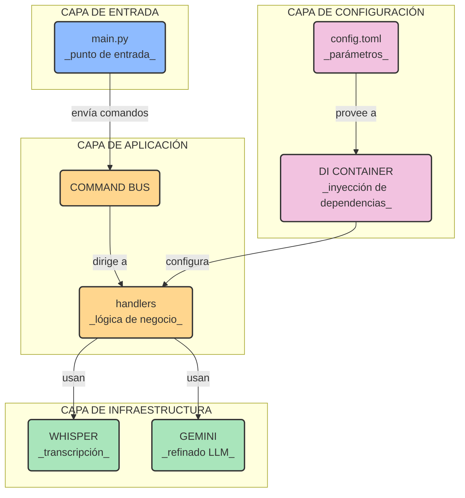

# 🧩 ARQUITECTURA

este proyecto sigue principios de diseño robustos como la **inyección de dependencias (DI)** y un **bus de comandos (CQRS)** para orquestar los servicios de una manera desacoplada y fácil de mantener

a continuación se detallan los componentes clave y cómo interactúan entre sí

---

### DIAGRAMA DE COMPONENTES

este diagrama muestra las capas principales de la aplicación y sus responsabilidades

---

### DESCRIPCIÓN DE COMPONENTES

| componente                                | descripción                                                              |
| ------------------------------------------- | ------------------------------------------------------------------------ |
| `src/v2m/main.py`             | el **controlador** principal que escucha comandos desde los scripts de shell (`start` `stop` `process`) |
| `src/v2m/core/di/container.py`  | el **orquestador** donde se conectan las interfaces con sus implementaciones concretas ej `LLMService` se resuelve a `GeminiLLMService` |
| `src/v2m/application/`        | el **cerebro** con la lógica de negocio pura los comandos y los handlers que definen qué hacer |
| `src/v2m/infrastructure/`     | las **manos** que interactúan con el mundo real como la API de WHISPER o GOOGLE GEMINI |
| `config.toml`                               | el **panel de control** para configurar modelos dispositivos y otros parámetros |
| `.env`                                      | los **secretos** como tu `GEMINI_API_KEY` para mantenerlos fuera del código fuente |
