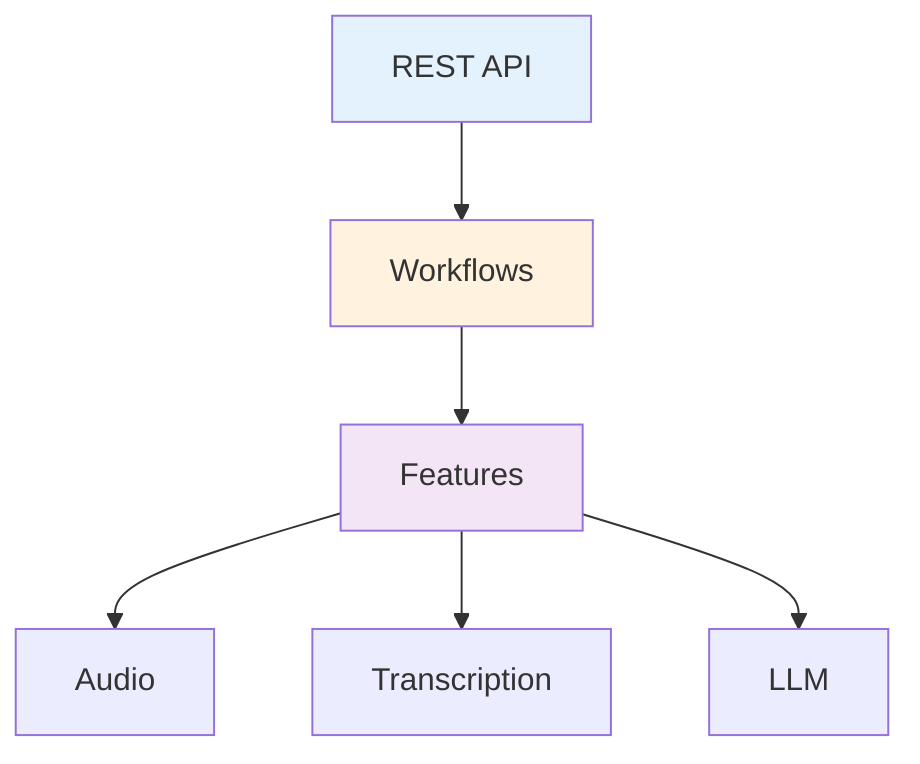

# Backend API (Python)

This section contains documentation automatically generated from the Voice2Machine backend source code.

!!! info "Auto-generated"
This documentation syncs automatically with code docstrings.
Source of truth: `apps/daemon/backend/src/v2m/`

---

## Main Modules

### Orchestration

- [**Workflows**](workflows.md) - Business workflow coordinators (Recording, LLM)
- [**REST API**](api.md) - FastAPI endpoints and data models (`api/` package)

### Foundation

- [**Config**](config.md) - Typed configuration system (`shared/config/`)

### Features

- [**Transcription**](transcription.md) - Whisper and inference engines
- [**LLM Services**](llm.md) - Gemini, Ollama, and Local Providers

---

## Layer Navigation

| Layer             | Responsibility                             |
| ----------------- | ------------------------------------------ |
| **API**           | HTTP endpoints, validation, serialization  |
| **Orchestration** | Business workflow coordination (Workflows) |
| **Features**      | Domain logic and specialized adapters      |

---

## Code Status

| Metric             | Value        |
| ------------------ | ------------ |
| Python Files       | 27           |
| Docstring Coverage | ~70%         |
| Style              | Google Style |
