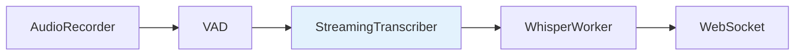

# Transcription

Audio to text transcription services using faster-whisper.

---

## PersistentWhisperWorker

Persistent worker that keeps the Whisper model loaded in VRAM between sessions.

**Location:** `v2m/features/transcription/persistent_model.py`

### Features

- **Lazy Loading**: Model loads the first time it's needed
- **Keep-Warm Policy**: Keeps model in VRAM based on configuration
- **GPU Optimized**: Uses `float16` or `int8_float16` for maximum performance

### Methods

```python
class PersistentWhisperWorker:
    def initialize_sync(self) -> None:
        """Loads model into VRAM (synchronous, for warmup)."""

    async def transcribe(self, audio: np.ndarray) -> str:
        """Transcribes audio to text."""

    async def unload(self) -> None:
        """Releases model from VRAM."""
```

---

## StreamingTranscriber

Real-time transcriber providing provisional feedback while the user speaks.

**Location:** `v2m/features/audio/streaming_transcriber.py`

### Data Flow



### Integration

The `StreamingTranscriber` emits events via WebSocket:

- `transcription_update`: Provisional text during recording
- `transcription_final`: Final text on stop
