# 🧩 System Architecture

!!! abstract "Technical Philosophy"
**Voice2Machine** implements a **strict Architecture based on Workflows and Features**, prioritizing decoupling, testability, and technological independence. The system adheres to SOTA 2026 standards like static typing in Python (Protocol) and Frontend/Backend separation via REST API.

---

## 🏗️ High-Level Diagram

```mermaid
graph TD
    subgraph Clients ["🔌 Clients (CLI / Scripts / GUI / Tauri)"]
        ClientApp["Any HTTP Client"]
    end

    subgraph Backend ["🐍 Backend Daemon (Python + FastAPI)"]
        API["FastAPI Package<br>(api/)"]

        subgraph Workflows ["🧠 Workflows (Orchestration)"]
            RecWF["RecordingWorkflow"]
            LLMWF["LLMWorkflow"]
        end

        subgraph Features ["🧩 Features (Domain + Logic)"]
            AudioFeat["Audio Service"]
            TranscFeat["Transcription Service"]
            LLMFeat["LLM Service"]
        end

        subgraph Shared ["⚙️ Shared (Foundation)"]
            Config["Config"]
            Errors["Errors"]
            Interfaces["Interfaces"]
        end
    end

    ClientApp <-->|REST + WebSocket| API
    API --> Workflows
    Workflows --> Features
    Features --> Shared

    style Clients fill:#e3f2fd,stroke:#1565c0
    style Backend fill:#e8f5e9,stroke:#2e7d32
    style Workflows fill:#fff3e0,stroke:#ef6c00
    style Features fill:#f3e5f5,stroke:#7b1fa2
    style Shared fill:#eceff1,stroke:#455a64
```



---

## 📦 Backend Components

### 1. API Layer (FastAPI)

Located in `apps/daemon/backend/src/v2m/api/`.

- **Modules**: `app.py`, `routes/`, `schemas.py`
- **REST Endpoints**: `/toggle`, `/start`, `/stop`, `/status`, `/health`
- **WebSocket**: `/ws/events` for real-time transcription streaming
- **Auto-documentation**: Swagger UI at `/docs`

!!! info "Modern Structure"
Starting from v0.3.0, the API is organized as a complete package, separating routes and schemas for better maintainability.

### 2. Workflows (Orchestration)

Located in `apps/daemon/backend/src/v2m/orchestration/`.

Instead of a monolithic Orchestrator, the system uses specialized Workflows for each business flow:

- **RecordingWorkflow**: Manages the complete capture and transcription lifecycle.
- **LLMWorkflow**: Coordinates text processing and translation.

This approach allows each flow to evolve independently without affecting the rest of the system.

### 3. Features (Domains)

Located in `apps/daemon/backend/src/v2m/features/`.

Each folder in `features/` represents a self-contained domain of knowledge including its own services and logic:

| Feature           | Responsibility                                                  |
| ----------------- | --------------------------------------------------------------- |
| **transcription** | Whisper implementations (`faster-whisper`).                     |
| **audio**         | Audio capture and management of the Rust engine (`v2m_engine`). |
| **llm**           | Integrations with Gemini, Ollama, and other providers.          |

### 4. Shared (Common Foundation)

Located in `apps/daemon/backend/src/v2m/shared/`.

- **Interfaces**: Global definitions via `typing.Protocol`.
- **Config**: `config.toml` management via Pydantic Settings.
- **Errors**: Shared exception hierarchies.

---

## ⚡ Client-Backend Communication

Voice2Machine uses **FastAPI REST + WebSocket** for communication:

### REST (Synchronous)

```bash
# Toggle recording
curl -X POST http://localhost:8765/toggle | jq

# Check status
curl http://localhost:8765/status | jq
```

### WebSocket (Streaming)

```javascript
const ws = new WebSocket("ws://localhost:8765/ws/events");
ws.onmessage = (e) => {
  const { event, data } = JSON.parse(e.data);
  if (event === "transcription_update") {
    console.log(data.text, data.final);
  }
};
```

---

## 🦀 Native Extensions (Rust)

For critical tasks where Python's GIL is a bottleneck, we use native extensions compiled in Rust (`v2m_engine`):

| Component       | Function                                        |
| --------------- | ----------------------------------------------- |
| **Audio I/O**   | Direct WAV writing to disk (zero-copy)          |
| **VAD**         | Ultra-low latency voice detection (Silero ONNX) |
| **Ring Buffer** | Lock-free circular buffer for real-time audio   |

---

## 🔄 Data Flow


---

## 🛡️ 2026 Design Principles

| Principle                 | Implementation                                                              |
| ------------------------- | --------------------------------------------------------------------------- |
| **Local-First**           | No data leaves the machine unless a cloud provider is explicitly configured |
| **Privacy-By-Design**     | Audio processed in memory, temp files deleted after transcription           |
| **Resilience**            | Automatic error recovery, subsystem restart if they fail                    |
| **Observability**         | Structured logging (OpenTelemetry), real-time metrics                       |
| **Performance is Design** | Async FastAPI, Rust for hot paths, warm model in VRAM                       |
