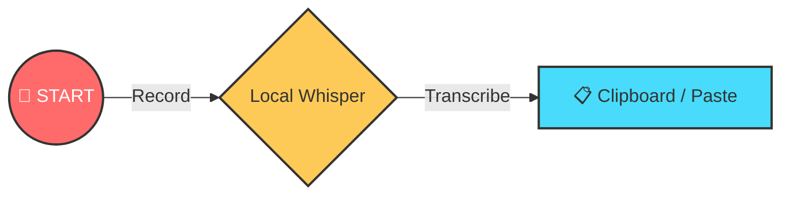
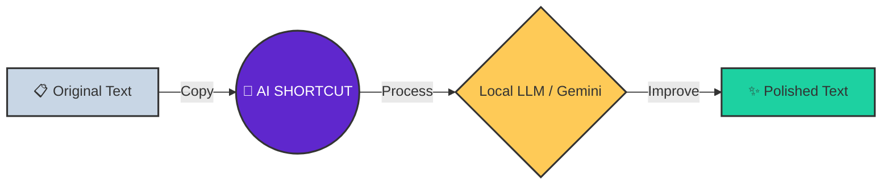

# 🕹️ Quick Start

!!! abstract "Executive Summary"
Voice2Machine has two superpowers: **Dictation** (Voice → Text) and **Refinement** (Text → Better Text).

This visual guide helps you understand the main workflows so you can be productive in minutes.

---

## 1. Dictation Flow (Voice → Text)

_Ideal for: Writing emails, code, or quick messages without touching the keyboard._

1.  **Focus**: Click on the text field where you want to write.
2.  **Activate shortcut** (Configurable, by default running `v2m-toggle.sh`). You'll hear a start sound 🔔.
3.  **Speak** clearly. Don't worry about being robotic, speak naturally.
4.  **Press the shortcut again** to stop. You'll hear an end sound 🔕.
5.  The text will **paste automatically** into your active field (or remain in clipboard if auto-paste is disabled).

---

## 2. Refinement Flow (Text → AI → Text)

_Ideal for: Correcting grammar, translating, or giving professional formatting to a rough draft._

1.  **Select and Copy** (`Ctrl + C`) the text you want to improve.
2.  **Activate the AI shortcut** (running `v2m-llm.sh`).
3.  Wait a few seconds (the AI is thinking 🧠).
4.  The improved text will **replace** your clipboard contents.
5.  **Paste** (`Ctrl + V`) the result.

---

## 💡 Pro Tips

!!! tip "Improve Your Accuracy" - **Speak fluently**: Whisper understands context from complete sentences better than isolated words. - **Hardware**: A noise-canceling microphone dramatically improves results. - **Configuration**: You can adjust the LLM "temperature" in settings to make it more creative or more literal.

!!! success "Privacy Guaranteed"
**Dictation** is 100% local (runs on your GPU). **Refinement** can be local (Ollama) or cloud (Gemini), you have full control in settings.
