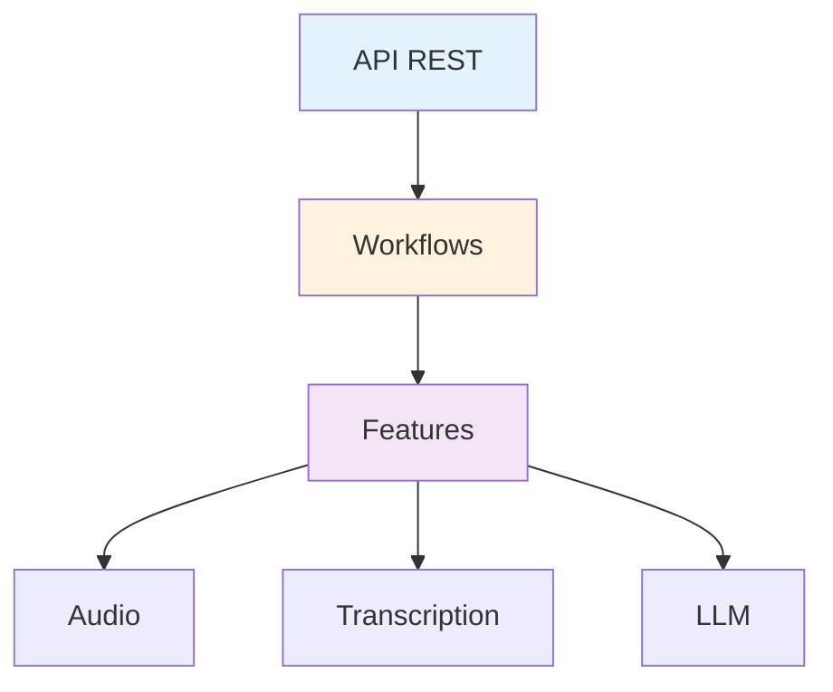

# API Backend (Python)

Esta sección contiene documentación generada automáticamente desde el código fuente del backend de Voice2Machine.

!!! info "Auto-generada"
Esta documentación se sincroniza automáticamente con los docstrings del código.
La fuente de verdad es: `apps/daemon/backend/src/v2m/`

---

## Módulos Principales

### Orquestación

- [**Workflows**](workflows.md) - Coordinadores de flujos de negocio (Recording, LLM)
- [**API REST**](api.md) - Endpoints FastAPI y modelos de datos (Paquete `api/`)

### Cimientos

- [**Config**](config.md) - Sistema de configuración tipada (`shared/config/`)

### Funcionalidades (Features)

- [**Transcripción**](transcription.md) - Whisper y motores de inferencia
- [**LLM Services**](llm.md) - Gemini, Ollama y Providers locales

---

## Navegación por Capas

| Capa              | Responsabilidad                                |
| ----------------- | ---------------------------------------------- |
| **API**           | Endpoints HTTP, validación, serialización      |
| **Orchestration** | Coordinación de flujos de trabajo (Workflows)  |
| **Features**      | Lógica de dominio y adaptadores especializados |

---

## Estado del Código

| Métrica              | Valor        |
| -------------------- | ------------ |
| Archivos Python      | 27           |
| Cobertura docstrings | ~70%         |
| Estilo               | Google Style |
