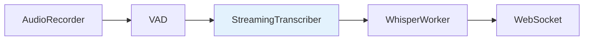

# Transcripción

Servicios de transcripción de audio a texto usando faster-whisper.

---

## PersistentWhisperWorker

Worker persistente que mantiene el modelo Whisper cargado en VRAM entre sesiones.

**Ubicación:** `v2m/features/transcription/persistent_model.py`

### Características

- **Lazy Loading**: El modelo se carga la primera vez que se necesita
- **Keep-Warm Policy**: Mantiene el modelo en VRAM según configuración
- **GPU Optimizado**: Usa `float16` o `int8_float16` para máximo rendimiento

### Métodos

```python
class PersistentWhisperWorker:
    def initialize_sync(self) -> None:
        """Carga el modelo en VRAM (síncrono, para warmup)."""

    async def transcribe(self, audio: np.ndarray) -> str:
        """Transcribe audio a texto."""

    async def unload(self) -> None:
        """Libera el modelo de VRAM."""
```

---

## StreamingTranscriber

Transcriptor en tiempo real que proporciona feedback provisional mientras el usuario habla.

**Ubicación:** `v2m/features/audio/streaming_transcriber.py`

### Flujo de Datos



### Integración

El `StreamingTranscriber` emite eventos via WebSocket:

- `transcription_update`: Texto provisional durante grabación
- `transcription_final`: Texto final al detener
