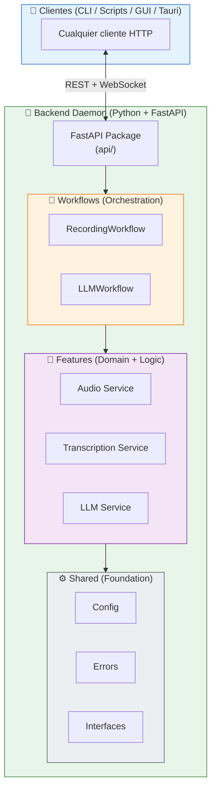
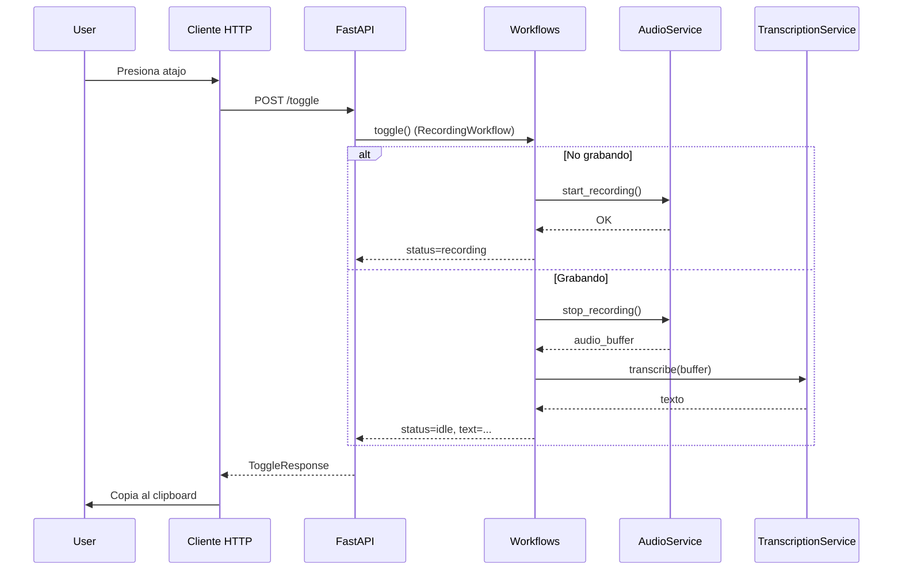

# 🧩 Arquitectura del Sistema

!!! abstract "Filosofía Técnica"
**Voice2Machine** implementa una **Arquitectura Hexagonal (Ports & Adapters)** estricta, priorizando el desacoplamiento, la testabilidad y la independencia tecnológica. El sistema se adhiere a estándares SOTA 2026 como tipos estáticos en Python (Protocol) y separación Frontend/Backend mediante API REST.

---

## 🏗️ Diagrama de Alto Nivel



---

## 📦 Componentes del Backend

### 1. API Layer (FastAPI)

Ubicado en `apps/daemon/backend/src/v2m/api/`.

- **Módulos**: `app.py`, `routes/`, `schemas.py`
- **Endpoints REST**: `/toggle`, `/start`, `/stop`, `/status`, `/health`
- **WebSocket**: `/ws/events` para streaming de transcripción en tiempo real
- **Documentación automática**: Swagger UI en `/docs`

!!! info "Estructura Moderna"
A partir de la v0.3.0, la API se organiza como un paquete completo, separando rutas y esquemas para mayor mantenibilidad.

### 2. Workflows (Orquestación)

Ubicado en `apps/daemon/backend/src/v2m/orchestration/`.

En lugar de un Orchestrator monolítico, el sistema utiliza Workflows especializados para cada flujo de negocio:

- **RecordingWorkflow**: Gestiona el ciclo de vida de captura y transcripción.
- **LLMWorkflow**: Coordina el procesamiento de texto y traducción.

Este enfoque permite que cada flujo evolucione de forma independiente sin afectar al resto del sistema.

### 3. Features (Dominios)

Ubicado en `apps/daemon/backend/src/v2m/features/`.

Cada carpeta en `features/` representa un dominio de conocimiento autocontenido que incluye sus propios servicios y lógica:

| Feature           | Responsabilidad                                          |
| ----------------- | -------------------------------------------------------- |
| **transcription** | Implementaciones de Whisper (`faster-whisper`).          |
| **audio**         | Captura de audio y manejo del motor Rust (`v2m_engine`). |
| **llm**           | Integraciones con Gemini, Ollama y otros proveedores.    |

### 4. Shared (Base Común)

Ubicado en `apps/daemon/backend/src/v2m/shared/`.

- **Interfaces**: Definiciones globales mediante `typing.Protocol`.
- **Config**: Gestión de `config.toml` mediante Pydantic Settings.
- **Errors**: Jerarquías de excepciones compartidas.

---

## ⚡ Comunicación Cliente-Backend

Voice2Machine utiliza **FastAPI REST + WebSocket** para la comunicación:

### REST (Síncrono)

```bash
# Toggle grabación
curl -X POST http://localhost:8765/toggle | jq

# Verificar estado
curl http://localhost:8765/status | jq
```

### WebSocket (Streaming)

```javascript
const ws = new WebSocket("ws://localhost:8765/ws/events");
ws.onmessage = (e) => {
  const { event, data } = JSON.parse(e.data);
  if (event === "transcription_update") {
    console.log(data.text, data.final);
  }
};
```

---

## 🦀 Extensiones Nativas (Rust)

Para tareas críticas donde el GIL de Python es un cuello de botella, utilizamos extensiones nativas compiladas en Rust (`v2m_engine`):

| Componente      | Función                                               |
| --------------- | ----------------------------------------------------- |
| **Audio I/O**   | Escritura de WAVs directa a disco (zero-copy)         |
| **VAD**         | Detección de voz de ultra-baja latencia (Silero ONNX) |
| **Buffer Ring** | Buffer circular lock-free para audio en tiempo real   |

---

## 🔄 Flujo de Datos



---

## 🛡️ Principios de Diseño 2026

| Principio                 | Implementación                                                                            |
| ------------------------- | ----------------------------------------------------------------------------------------- |
| **Local-First**           | Ningún dato sale de la máquina a menos que se configure explícitamente un proveedor cloud |
| **Privacy-By-Design**     | Audio procesado en memoria, archivos temporales eliminados después de transcripción       |
| **Resiliencia**           | Recuperación automática de errores, reinicio de subsistemas si fallan                     |
| **Observabilidad**        | Logging estructurado (OpenTelemetry), métricas en tiempo real                             |
| **Performance is Design** | FastAPI async, Rust para hot paths, modelo warm en VRAM                                   |
