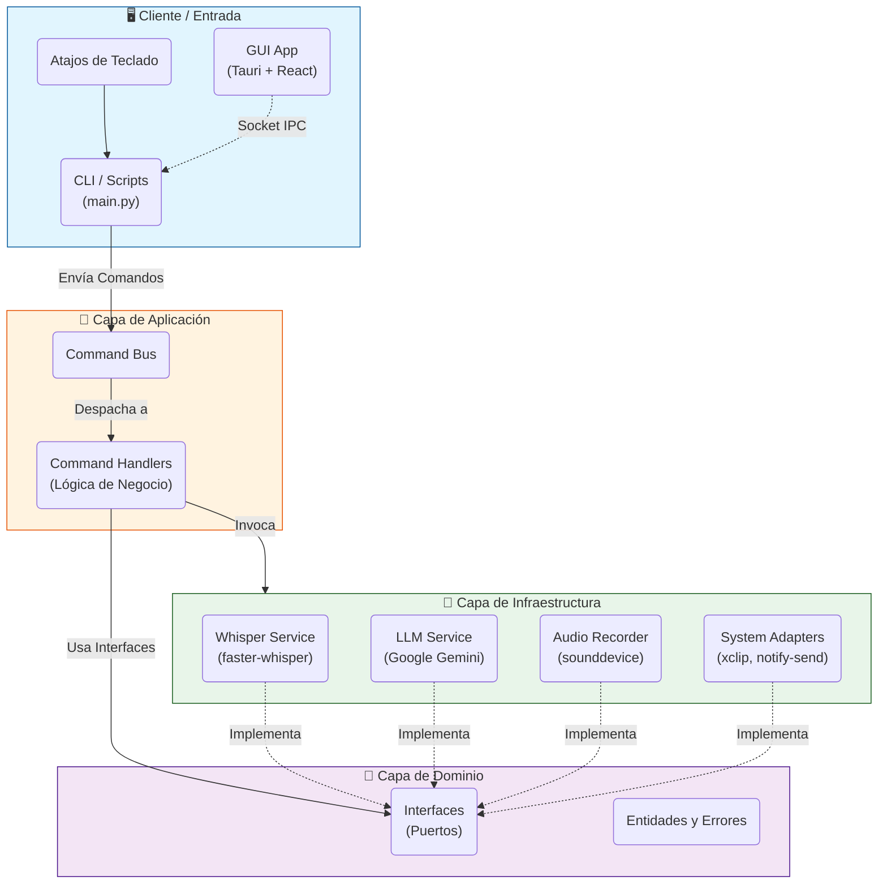

# 🧩 Arquitectura del Sistema

**Voice2Machine** está diseñado siguiendo principios de **Arquitectura Hexagonal (Puertos y Adaptadores)** y **CQRS (Command Query Responsibility Segregation)**. Esto asegura un bajo acoplamiento entre la lógica de negocio y los detalles de infraestructura (como la librería de audio o el proveedor de LLM).

---

## Diagrama de Alto Nivel

El siguiente diagrama ilustra el flujo de datos y la separación de responsabilidades entre las capas del sistema.

---

## Componentes Principales

### 1. Capa de Entrada (Client & GUI)
Puntos de acceso al sistema. No contienen lógica de negocio, solo intención del usuario.

*   **`main.py` (Daemon)**: El cerebro persistente. Corre como un servidor escuchando comandos.
*   **Scripts Bash**: Atajos ligeros (`v2m-toggle.sh`) que envían señales al daemon.
*   **Tauri GUI**: Aplicación de escritorio (Rust + React) que actúa como "control remoto" visual, comunicándose vía sockets Unix.

### 2. Capa de Aplicación (Application)
Orquesta las operaciones.

*   **Command Bus**: Recibe DTOs (Data Transfer Objects) como `StartRecordingCommand` y los enruta.
*   **Handlers**: Ejecutan casos de uso puros (ej. "Iniciar grabación", "Procesar texto").

### 3. Capa de Dominio (Domain)
El núcleo agnóstico. Aquí viven las reglas inmutables.

*   **Interfaces**: Contratos estrictos (ej. `TranscriptionService`) que obligan a la infraestructura a comportarse de cierta manera.
*   **Entidades**: Objetos de valor y estado del negocio.

### 4. Capa de Infraestructura (Infrastructure)
Implementación concreta ("el mundo real").

*   **WhisperService**: Wrapper optimizado para `faster-whisper` con gestión de VRAM.
*   **GeminiLLMService**: Cliente para la API de Google AI Studio.
*   **LinuxAdapters**: Integración nativa con `DBus` y `X11/Wayland` (portapapeles).

---

## Patrones de Diseño Clave (2026 Standards)

*   **Inyección de Dependencias (DI)**: Todo componente recibe sus dependencias, facilitando tests unitarios (mocking) y cambios de tecnología (ej. cambiar Gemini por OpenAI sin tocar el dominio).
*   **Singleton de Modelos**: Los modelos pesados (Whisper) se mantienen "calientes" en VRAM dentro del proceso Daemon, eliminando el *cold start*.
*   **Asincronía Non-blocking**: El núcleo usa `asyncio` para manejar E/S (grabación, red) sin congelar la interfaz.
