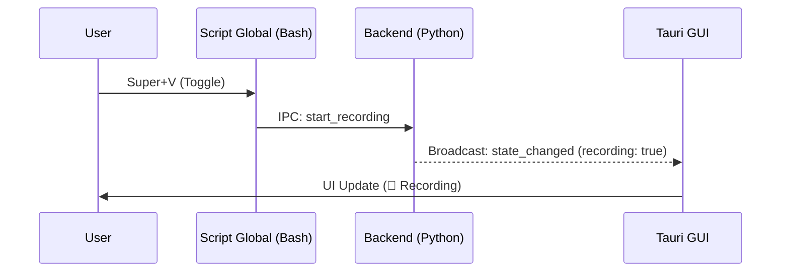

# 🖥️ Arquitectura y Guía Frontend

!!! abstract "Stack Tecnológico 2026"
El frontend de Voice2Machine es una aplicación **Tauri 2.0** que utiliza **React 19** y **TypeScript**. Está diseñado para ser ultraligero (<50MB RAM), reactivo y desacoplado del procesamiento pesado (Backend).

---

## 🏗️ Estructura Modular

La aplicación se organiza en componentes funcionales aislados para facilitar el mantenimiento y testing.

### Componentes Core (`src/components/`)

- **Sidebar**: Navegación principal y visualización de telemetría (CPU/GPU) en tiempo real.
- **Studio**: Editor de texto avanzado para corrección y refinado de transcripciones.
- **SettingsModal**: Panel de configuración gestionado con `react-hook-form` y `zod`.
- **Transcriptions**: Lista virtualizada de historial de transcripciones.

### Gestión de Estado (Zustand Stores)

Implementamos una arquitectura de estados centralizada con **Zustand** dividida por dominios para maximizar el rendimiento y la legibilidad:

1.  **`backendStore.ts`**: Fuente de verdad global para el estado del daemon (conexión, estatus de grabación, transcripción actual y errores).
2.  **`telemetryStore.ts`**: Canal dedicado a métricas de alto rendimiento (CPU, RAM, GPU VRAM) procesadas de forma reactiva.
3.  **`uiStore.ts`**: Gestiona el estado volátil de la interfaz (navegación, modales, alertas).

---

## ⚡ Ciclo de Vida y Eventos

### Inicialización

1.  La app Tauri arranca (`main-tauri.rs`).
2.  React monta `App.tsx`.
3.  El componente `BackendInitializer` carga el historial persistido e inicia la escucha de eventos.
4.  Se sincroniza el estado inicial mediante un comando `get_status` al daemon.

### Sincronización Bidireccional

El frontend refleja en tiempo real lo que ocurre en el backend mediante un sistema híbrido:

- **Push**: Escucha eventos `v2m://state-update` emitidos por el puente Rust.
- **Poll (Fallback)**: Si no hay actividad de eventos, el inicializador realiza consultas periódicas para asegurar que la UI no se desincronice.



---

## 🛠️ Desarrollo

### Comandos Clave

```bash
# Iniciar modo desarrollo (Hot Reload)
npm run tauri dev

# Construir binario optimizado
npm run tauri build

# Ejecutar tests (Vitest)
npm run test
```

### Testing (Vitest + React Testing Library)

Los tests se ubican junto al código fuente (`.spec.tsx`).

- **Unitarios**: Verifican lógica de componentes aislados.
- **Integración**: Verifican flujos completos (ej. Settings form validation).

---

## 🎨 Guía de Estilo UI

Utilizamos **TailwindCSS** con un sistema de diseño consistente.

- **Colores**: Paleta neutra (`slate`) con acentos semánticos (`rose` para grabación, `emerald` para éxito).
- **Tipografía**: Sans-serif moderna (Inter/Roboto) optimizada para legibilidad.
- **Modo Oscuro**: Soporte nativo de primera clase.

---

## 🐛 Troubleshooting Frontend

### "Waiting for Daemon..."

La UI se queda en gris o mostrando un spinner.

- **Causa**: No hay conexión al socket IPC.
- **Solución**: Verifica que el backend corre (`python scripts/verify_daemon.py`).

### Gráficas congeladas

- **Causa**: El `TelemetryContext` perdió el flujo de datos.
- **Solución**: Reinicia la GUI (`Ctrl+R` en modo dev) o reconecta el backend.
