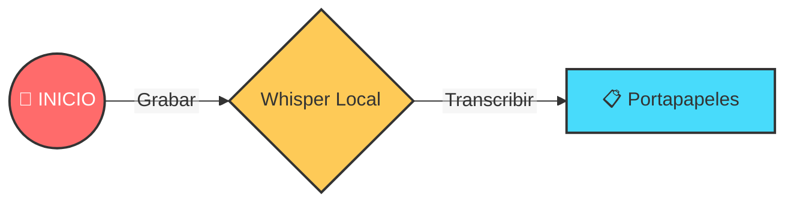
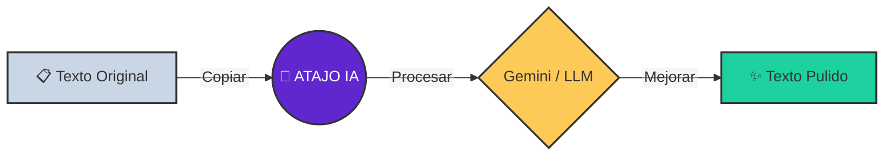

# 🕹️ GUÍA RÁPIDA

> **Resumen Ejecutivo**: Voice2Machine tiene dos superpoderes: **Dictado** (Voz → Texto) y **Refinado** (Texto → Mejor Texto).

Esta guía visual te ayuda a entender los flujos de trabajo principales.

---

## 1. Flujo de Dictado (Voz → Texto)

*Ideal para: Escribir correos, código o mensajes rápidos sin tocar el teclado.*

1.  **Activa el atajo** (ej. `Super + V`). Escucharás un sonido de inicio 🔔.
2.  **Habla** claramente.
3.  **Pulsa el atajo de nuevo** para detener. Escucharás un sonido de fin 🔕.
4.  El texto aparecerá mágicamente en tu **portapapeles** (listo para pegar `Ctrl + V`).

---

## 2. Flujo de Refinado (Texto → IA → Texto)

*Ideal para: Corregir gramática, traducir o dar formato profesional a un borrador.*

1.  **Copia algo de texto** (`Ctrl + C`).
2.  **Activa el atajo de IA** (ej. `Super + G`).
3.  Espera unos segundos (la IA está pensando 🧠).
4.  El texto mejorado **reemplaza** lo que tenías en el portapapeles. ¡Pégalo!

---

## 💡 Consejos Pro

- **Habla fluido**: Whisper entiende mejor frases completas que palabras sueltas.
- **Micro**: Un buen micrófono mejora drásticamente la precisión.
- **Privacidad**: Recuerda que el **Dictado** es 100% local. El **Refinado** usa la nube (Google Gemini) solo si tú lo activas.
