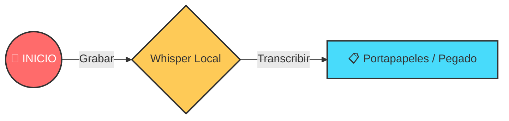
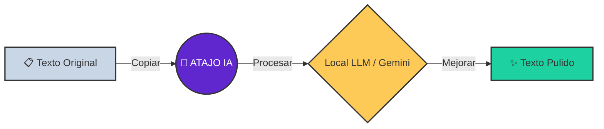

# 🕹️ Guía Rápida

!!! abstract "Resumen Ejecutivo"
Voice2Machine tiene dos superpoderes: **Dictado** (Voz → Texto) y **Refinado** (Texto → Mejor Texto).

Esta guía visual te ayuda a entender los flujos de trabajo principales para que seas productivo en minutos.

---

## 1. Flujo de Dictado (Voz → Texto)

_Ideal para: Escribir correos, código o mensajes rápidos sin tocar el teclado._

1.  **Foco**: Haz clic en el campo de texto donde quieres escribir.
2.  **Activa el atajo** (Configurable, por defecto ejecutando `v2m-toggle.sh`). Escucharás un sonido de inicio 🔔.
3.  **Habla** claramente. No te preocupes por ser un robot, habla natural.
4.  **Pulsa el atajo de nuevo** para detener. Escucharás un sonido de fin 🔕.
5.  El texto se **pegará automáticamente** en tu campo activo (o quedará en el portapapeles si la auto-escritura está desactivada).

---

## 2. Flujo de Refinado (Texto → IA → Texto)

_Ideal para: Corregir gramática, traducir o dar formato profesional a un borrador sucio._

1.  **Selecciona y Copia** (`Ctrl + C`) el texto que quieres mejorar.
2.  **Activa el atajo de IA** (ejecutando `v2m-llm.sh`).
3.  Espera unos segundos (la IA está pensando 🧠).
4.  El texto mejorado **reemplazará** el contenido de tu portapapeles.
5.  **Pega** (`Ctrl + V`) el resultado.

---

## 💡 Consejos Pro

!!! tip "Mejora tu Precisión" - **Habla fluido**: Whisper entiende mejor el contexto de frases completas que palabras sueltas. - **Hardware**: Un micrófono con cancelación de ruido mejora drásticamente los resultados. - **Configuración**: Puedes ajustar la "temperatura" del LLM en la configuración para hacerlo más creativo o más literal.

!!! success "Privacidad Garantizada"
El **Dictado** es 100% local (ejecutado en tu GPU). El **Refinado** puede ser local (Ollama) o nube (Gemini), tú tienes el control total en la configuración.
