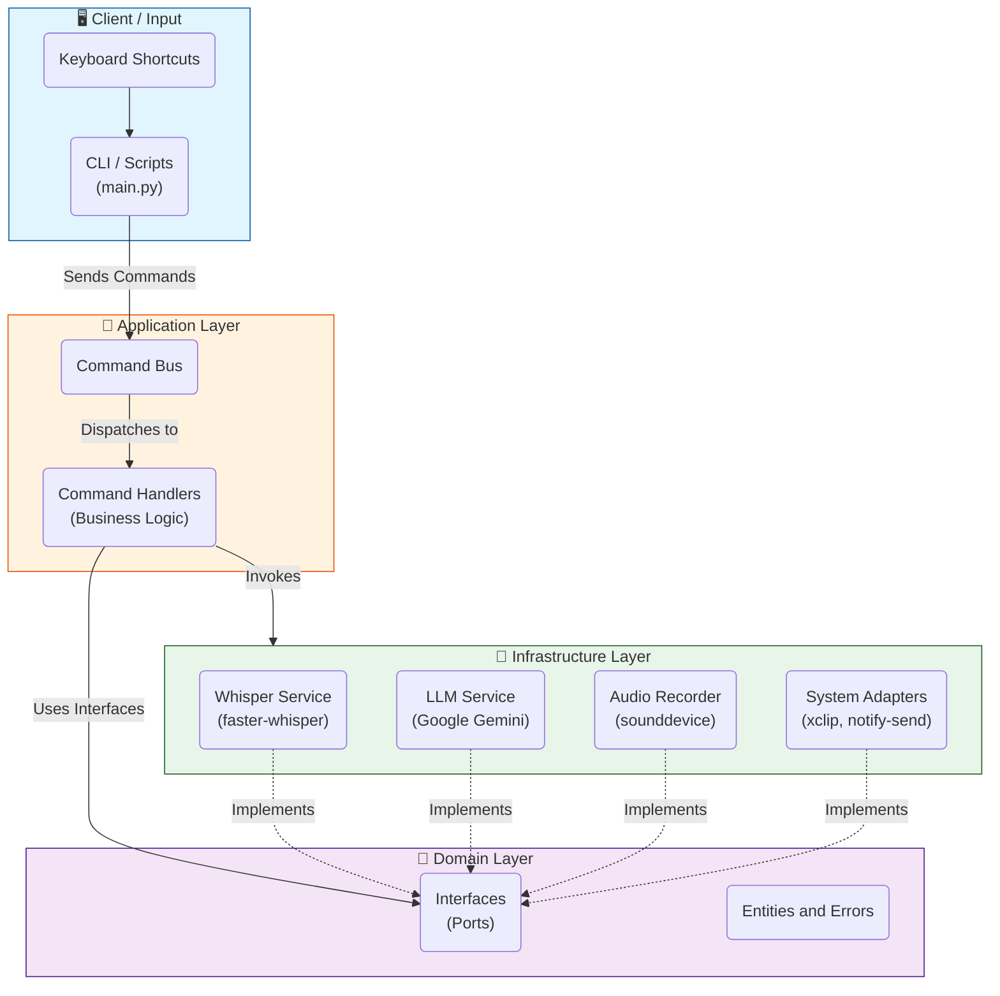

# 🧩 System Architecture

**Voice2Machine** is designed following **Hexagonal Architecture (Ports and Adapters)** and **CQRS (Command Query Responsibility Segregation)** principles. This ensures low coupling between business logic and infrastructure details (such as the audio library or LLM provider).

---

## High-Level Diagram

The following diagram illustrates the data flow and separation of responsibilities between system layers.

---

## Main Components

### 1. Input Layer (Client)
The system entry point. Contains no business logic, only receives user intent and converts it to a **Command**.
*   **`main.py`**: Acts as the main controller. Can run in *Daemon* mode (persistent server) or *Client* mode (ephemeral command dispatch).
*   **Bash Scripts**: Lightweight scripts (`v2m-toggle.sh`, `v2m-process.sh`) that bridge OS shortcuts to the Python application.

### 2. Application Layer
Coordinates system actions.
*   **Command Bus**: Receives commands (e.g., `StartRecordingCommand`) and routes them to the appropriate handler.
*   **Command Handlers**: Execute specific logic (e.g., `StartRecordingHandler` starts the audio service and notifies the user).

### 3. Domain Layer
Defines system rules and contracts. Technology-agnostic.
*   **Interfaces**: Define *what* a service should do (e.g., `TranscriptionService`), but not *how*.
*   **Errors**: Semantic business exceptions (e.g., `MicrophoneNotFoundError`).

### 4. Infrastructure Layer
Implements domain interfaces using concrete libraries and technologies.
*   **WhisperService**: `TranscriptionService` implementation using `faster-whisper`.
*   **GeminiLLMService**: `LLMService` implementation using Google's API.
*   **LinuxAdapters**: Implementations for Linux system interaction (notifications, clipboard).

---

## Key Design Patterns

*   **Dependency Injection (DI)**: Used for system assembly. Allows swapping implementations (e.g., switching Gemini for GPT-4) without touching business logic.
*   **Singleton**: The Whisper model loads once in memory (in the Daemon) to avoid loading latency on each request.
*   **Lazy Loading**: Heavy models load only when needed or at Daemon startup, optimizing resource usage.
