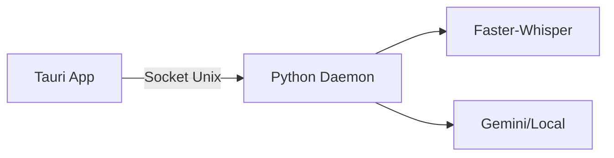

# GUÍA DE LA INTERFAZ GRÁFICA (GUI)

La GUI de **voice2machine** es una aplicación de escritorio nativa construida con Tauri que proporciona control visual del daemon de transcripción.

---

## REQUISITOS PREVIOS

Antes de usar la GUI, asegúrate de que:

1. **El daemon v2m esté corriendo**:
   ```bash
   # verificar si está activo
   pgrep -f v2m

   # o iniciar manualmente
   ./scripts/v2m-daemon.sh start
   ```

2. **Socket disponible** en `/tmp/v2m.sock`

---

## INICIAR LA GUI

### Opción 1: Desde el binario (producción)
```bash
./apps/frontend/src-tauri/target/release/voice2machine
```

### Opción 2: En modo desarrollo
```bash
cd apps/frontend
npm run tauri dev
```

---

## INTERFAZ DE USUARIO

### ELEMENTOS PRINCIPALES

```
┌─────────────────────────────────────┐
│  🎤 voice2machine      ● Listo      │  ← Header con estado
├─────────────────────────────────────┤
│                                     │
│            [ 🎤 ]                   │  ← Botón principal
│                                     │
├─────────────────────────────────────┤
│                                     │
│   Texto transcrito aparece aquí...  │  ← Área de texto
│                                     │
├─────────────────────────────────────┤
│    [ Copiar ]    [ Refinar IA ]     │  ← Acciones
└─────────────────────────────────────┘
```

### ESTADOS DEL SISTEMA

| Indicador | Estado | Significado |
|-----------|--------|-------------|
| 🟢 | Listo | Sistema preparado para grabar |
| 🔴 | Grabando... | Capturando audio del micrófono |
| 🔵 | Transcribiendo... | Procesando audio con Whisper |
| 🔵 | Refinando con IA... | Mejorando texto con LLM |
| ⚪ | Daemon desconectado | El daemon no está corriendo |
| 🔴 | Error | Algo falló (ver mensaje) |

---

## FLUJO DE USO

1. **Iniciar grabación**: Click en el botón del micrófono
2. **Hablar**: El sistema muestra "Grabando..." pulsando
3. **Detener**: Click nuevamente para finalizar
4. **Transcripción**: El texto aparece automáticamente
5. **Refinar (opcional)**: Click en "Refinar IA" para mejorar el texto
6. **Copiar**: Click en "Copiar" para enviarlo al portapapeles

---

## ATAJOS DE TECLADO

> [!NOTE]
> Los atajos de teclado globales (`Super+V`) funcionan independientemente de la GUI y controlan el mismo daemon. Si activas la grabación por teclado, la GUI reflejará el estado automáticamente.

---

## TROUBLESHOOTING

### "Daemon desconectado"

El socket `/tmp/v2m.sock` no existe o el daemon no responde.

```bash
# reiniciar el daemon
./scripts/v2m-daemon.sh restart
```

### El botón no responde

El sistema está en estado "transcribiendo" o "procesando". Espera a que termine.

### No hay audio

Verifica que el micrófono esté configurado correctamente en el sistema.

---

## ARQUITECTURA TÉCNICA

La GUI es un **cliente** del daemon Python. No contiene lógica de IA.



Esto garantiza:
- **Zero overhead**: La GUI no afecta el rendimiento de inferencia
- **Sincronización**: Múltiples clientes (GUI, scripts) comparten el mismo estado
- **Footprint mínimo**: ~13MB, <50MB RAM
