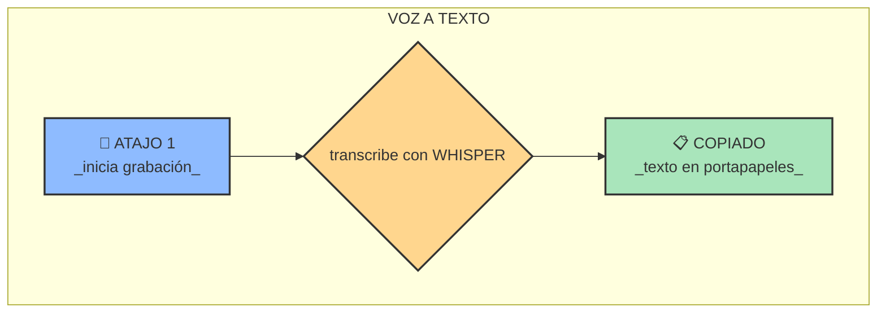
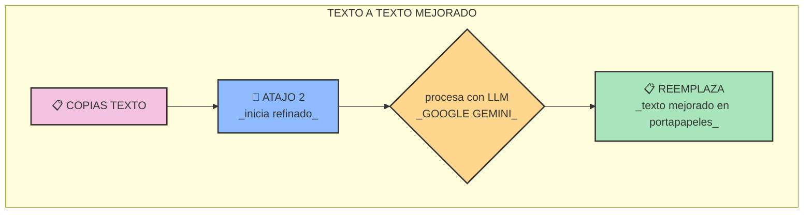

# 🕹️ GUÍA RÁPIDA

esta guía te muestra cómo usar las funciones principales de la herramienta de dictado

### FLUJO DE DICTADO (VOZ → TEXTO)

este es el flujo principal para capturar tu voz y convertirla en texto

1.  **activa el atajo de teclado** para iniciar la grabación
2.  **habla claramente** en tu micrófono
3.  **vuelve a pulsar el atajo** para detener la grabación
4.  el texto transcrito **se copiará automáticamente** a tu portapapeles

### FLUJO DE REFINADO (TEXTO → TEXTO MEJORADO)

si la transcripción necesita correcciones o un formato específico puedes usar el flujo de refinado

1.  **copia el texto** que deseas mejorar a tu portapapeles
2.  **activa el segundo atajo de teclado**
3.  el texto será procesado por el LLM de GOOGLE GEMINI
4.  el texto mejorado **reemplazará el contenido** de tu portapapeles

