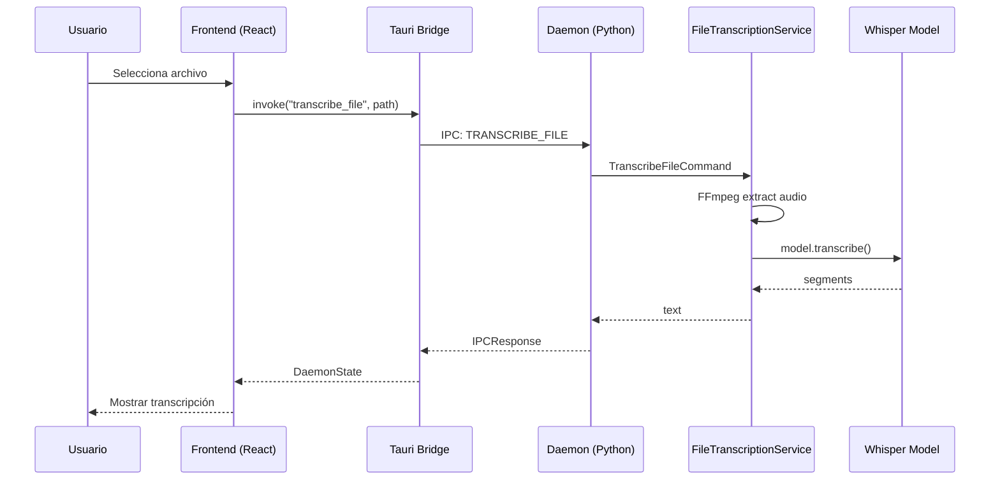

# Export Feature - Walkthrough

## Resumen

Se implementó exitosamente la funcionalidad de **Exportar Transcripción** que permite a los usuarios:
1. Seleccionar archivos de video o audio desde el sistema de archivos
2. Extraer audio de videos usando FFmpeg
3. Transcribir el audio usando el modelo Whisper local
4. Descargar la transcripción como archivo de texto

---

## Cambios Realizados

### Backend (Python)

#### [commands.py](file:///home/zarvent/developer/v2m-lab/apps/backend/src/v2m/application/commands.py)
Añadido [TranscribeFileCommand](file:///home/zarvent/developer/v2m-lab/apps/backend/src/v2m/application/commands.py#126-142) para representar la acción de transcribir un archivo:
```python
class TranscribeFileCommand(Command):
    """Comando para transcribir un archivo de audio/video desde el disco."""
    def __init__(self, file_path: str) -> None:
        self.file_path = file_path
```

---

#### [ipc_protocol.py](file:///home/zarvent/developer/v2m-lab/apps/backend/src/v2m/core/ipc_protocol.py)
Añadido nuevo comando IPC:
```python
TRANSCRIBE_FILE = "TRANSCRIBE_FILE"
```

---

#### [NEW] [file_transcription_service.py](file:///home/zarvent/developer/v2m-lab/apps/backend/src/v2m/infrastructure/file_transcription_service.py)
Nuevo servicio que encapsula:
- Verificación de disponibilidad de FFmpeg
- Extracción de audio de video (streaming a memoria, 16kHz mono PCM)
- Normalización de archivos de audio
- Transcripción usando el modelo Whisper existente

**Formatos soportados:**
- **Video:** MP4, MOV, MKV, AVI, WEBM
- **Audio:** WAV, MP3, FLAC, OGG, M4A, AAC, AIFF

---

#### [command_handlers.py](file:///home/zarvent/developer/v2m-lab/apps/backend/src/v2m/application/command_handlers.py)
Añadido [TranscribeFileHandler](file:///home/zarvent/developer/v2m-lab/apps/backend/src/v2m/application/command_handlers.py#369-416):
```python
class TranscribeFileHandler(CommandHandler):
    async def handle(self, command: TranscribeFileCommand) -> str:
        loop = asyncio.get_running_loop()
        return await loop.run_in_executor(
            _ml_executor,
            self.file_transcription_service.transcribe_file,
            command.file_path,
        )
```

---

#### [container.py](file:///home/zarvent/developer/v2m-lab/apps/backend/src/v2m/core/di/container.py)
Registrado el nuevo servicio y handler en el contenedor DI:
```python
self.file_transcription_service = FileTranscriptionService(self.transcription_service)
self.transcribe_file_handler = TranscribeFileHandler(self.file_transcription_service)
self.command_bus.register(self.transcribe_file_handler)
```

---

#### [daemon.py](file:///home/zarvent/developer/v2m-lab/apps/backend/src/v2m/daemon.py)
Añadido handler para el comando `TRANSCRIBE_FILE` en el servidor IPC.

---

### Frontend (Tauri Bridge)

#### [Cargo.toml](file:///home/zarvent/developer/v2m-lab/apps/frontend/src-tauri/Cargo.toml)
Añadida dependencia:
```toml
tauri-plugin-dialog = "2"
```

---

#### [lib.rs](file:///home/zarvent/developer/v2m-lab/apps/frontend/src-tauri/src/lib.rs)
Añadido comando Tauri [transcribe_file](file:///home/zarvent/developer/v2m-lab/apps/backend/src/v2m/infrastructure/file_transcription_service.py#94-138) y plugin de diálogos:
```rust
#[tauri::command]
async fn transcribe_file(app: tauri::AppHandle, file_path: String) -> Result<DaemonState, IpcError> {
    let data = json!({ "file_path": file_path });
    let result = send_json_request("TRANSCRIBE_FILE", Some(data))?;
    // ...
}
```

---

### Frontend (React)

#### [NEW] [Export.tsx](file:///home/zarvent/developer/v2m-lab/apps/frontend/src/components/Export.tsx)
Componente completo con:
- Drop zone con efecto glassmorphism
- Selector de archivos nativo via Tauri Dialog
- Estados de progreso animados
- Vista previa de transcripción
- Botones de copiar y descargar

---

#### [Sidebar.tsx](file:///home/zarvent/developer/v2m-lab/apps/frontend/src/components/Sidebar.tsx)
Añadido ítem de navegación "Export" con [VideoIcon](file:///home/zarvent/developer/v2m-lab/apps/frontend/src/assets/Icons.tsx#530-553).

---

#### [App.tsx](file:///home/zarvent/developer/v2m-lab/apps/frontend/src/App.tsx)
Añadida ruta para el componente Export.

---

#### [App.css](file:///home/zarvent/developer/v2m-lab/apps/frontend/src/App.css)
+547 líneas de estilos premium con:
- Glassmorphism animado
- Gradientes OKLCH
- Animaciones de procesamiento
- Estados de error y éxito

---

#### [Icons.tsx](file:///home/zarvent/developer/v2m-lab/apps/frontend/src/assets/Icons.tsx)
Añadidos nuevos iconos: [UploadIcon](file:///home/zarvent/developer/v2m-lab/apps/frontend/src/assets/Icons.tsx#511-529), [VideoIcon](file:///home/zarvent/developer/v2m-lab/apps/frontend/src/assets/Icons.tsx#530-553), [AudioIcon](file:///home/zarvent/developer/v2m-lab/apps/frontend/src/assets/Icons.tsx#554-572).

---

## Verificación

### Compilación
- ✅ `npm run build` - Frontend compila sin errores
- ✅ `cargo check` - Tauri/Rust compila sin errores
- ✅ Python imports verificados

### Pruebas Pendientes
- [ ] Test con archivo MP4
- [ ] Test con archivo WAV
- [ ] Test con archivo MP3
- [ ] Verificar descarga de .txt

---

## Arquitectura



---

## Dependencias

### Backend
- FFmpeg (externo, instalado via `apt`)
- faster-whisper (existente)
- numpy (existente)

### Frontend
- @tauri-apps/plugin-dialog (nuevo)
- tauri-plugin-dialog (Rust, nuevo)
