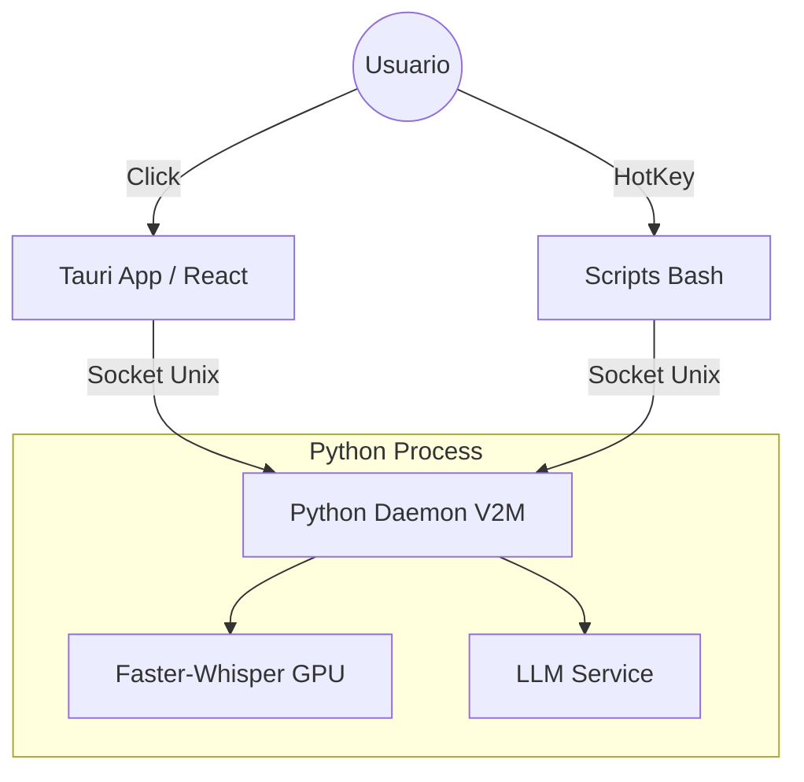

# RFC-003: IMPLEMENTACIÓN DE GUI NATIVA CON TAURI 2.0

**Fecha:** 2025-12-08
**Autor:** Cesar Sebastian
**Estado:** Implementado (Fase Beta)
**Versión:** 3.0.0-gui

---

## 1. RESUMEN EJECUTIVO

Hemos migrado de una arquitectura basada puramente en CLI/Scripts a un modelo híbrido con interfaz gráfica (GUI). Para esto, **NO** utilizamos Electron (bloated) ni PyQt (feo/pesado), sino **TAURI 2.0**.

El resultado es una aplicación de escritorio completa que pesa **~13MB**, consume **<50MB de RAM** en reposo y se comunica con nuestro motor de IA existente mediante **sockets unix**, sin interferir en el rendimiento de la inferencia.

---

## 2. MOTIVACIÓN: ¿POR QUÉ ESTE CAMBIO AHORA?

Hasta la versión 2.x, `voice2machine` era funcional pero "ciego". El usuario dependía de notificaciones del sistema (`notify-send`) y no tenía feedback visual del estado real del modelo (cargando, grabando, procesando).

### El problema de las alternativas tradicionales

Al evaluar opciones para la GUI, nos enfrentamos al clásico trilema del ecosistema Python:

*   **ELECTRON:** Inaceptable. Shippear un navegador Chromium completo (>100MB) solo para controlar un script es ineficiente.
*   **PYQT / TKINTER:** Mantienen el GIL (Global Interpreter Lock) de Python ocupado o complican el threading con el modelo Whisper. Visualmente se sienten "legacy".
*   **WEBVIEW PURE:** Carecen de acceso seguro al sistema a bajo nivel.

### La solución: Tauri + React

Tauri nos permite usar **RUST** para el backend de la ventana (seguro, rápido, nativo) y **REACT** para la UI. Lo crítico aquí es que **la GUI NO CONTIENE la lógica de IA**. La GUI es solo un "control remoto" de lujo para nuestro daemon de Python.

---

## 3. ARQUITECTURA TÉCNICA (EL GRAN SALTO)

Aquí es donde pasamos de "scripting" a "ingeniería de software".

### 3.1 El modelo "GUI as a Client"

Inicialmente, se consideró controlar el daemon mediante `stdin/stdout`. **ERROR CRÍTICO**. Eso hubiera bloqueado el event loop de `asyncio` en Python y habría aislado la GUI de los atajos de teclado globales.

**La arquitectura final implementada es:**

**Concepto Clave: SINGLE SOURCE OF TRUTH.**
El daemon es la verdad. La GUI y los scripts bash son pares (peers). Si activas la grabación por teclado, el daemon cambia de estado y la GUI (mediante polling) refleja ese cambio.

### 3.2 Protocolo de Comunicación (IPC)

Implementamos un protocolo binario ligero sobre sockets unix en `src-tauri/src/lib.rs` para replicar el comportamiento de `client.py`:

1.  **Conexión:** `UnixStream::connect("/tmp/v2m.sock")`
2.  **Framing:** 4 bytes (big-endian) indicando longitud + payload UTF-8.
3.  **Respuesta:** Lectura asíncrona no bloqueante.

Esto garantiza que la interfaz en Rust sea **non-blocking** y compatible 100% con el daemon existente.

---

## 4. AUDITORÍA Y MÉTRICAS

### Win (Lo que salió bien)

*   **Footprint ridículo:** El binario final release pesa **13MB**. Comparado con los ~120MB de una app Electron equivalente, es una optimización del **89%**.
*   **Zero Interference:** Al correr la GUI en un proceso separado (Rust), el proceso de Python tiene el 100% del GIL y la CPU disponibles para inferencia. La GUI no "tartamudea" cuando Whisper está trabajando.
*   **Ecosistema React:** Iteración de UI rapidísima gracias a hot-reload y componentes modernos.

### Deuda Técnica Actual (Work in Progress)

*   **Polling vs Pub/Sub:**
    *   *Estado:* La GUI pregunta cada 500ms "¿estás grabando?".
    *   *Mejora:* Implementar Server-Sent Events o broadcast en el daemon para eliminar latencia.
*   **Hardcoded Paths:**
    *   *Estado:* `/tmp/v2m.sock` fijo.
    *   *Mejora:* Leer configuración compartida.
*   **Distribución:**
    *   *Estado:* Asume Python instalado.
    *   *Mejora:* First-run wizard para guiar al usuario.

---

## 5. ROADMAP DE ESCALADO

Ahora que tenemos una ventana real en el sistema operativo, las posibilidades se disparan:

### Corto Plazo (Q1 2026)
*   **Feedback visual de audio:** Exponer endpoint `GET_AUDIO_LEVEL` en el daemon (RMS) para visualización en tiempo real.
*   **Editor de Prompts:** Permitir editar el `system_prompt` desde la GUI.

### Largo Plazo
*   **Windows Support:** Migrar de sockets unix a named pipes.
*   **Plugin System:** Cargar "habilidades" dinámicas.

---

## 6. CONCLUSIÓN

Esta actualización no es solo "una cara bonita". Es la maduración del proyecto. Hemos desacoplado la presentación de la lógica, permitiendo que `voice2machine` deje de ser una herramienta de hacker de terminal y se convierta en un producto de consumo viable, sin sacrificar ni un milisegundo de rendimiento.

El código es limpio, la arquitectura es modular y el rendimiento es SOTA. Estamos listos.
