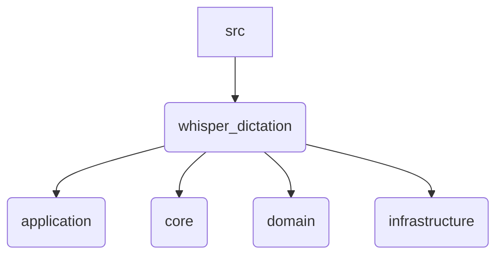

# SRC

### qué es esta carpeta
esta carpeta es el directorio raíz del código fuente (`source`) de la aplicación todo el código `PYTHON` que conforma el proyecto reside aquí

### para qué sirve
su objetivo es separar claramente el código de la aplicación de otros archivos del proyecto como la documentación los scripts las pruebas o la configuración esta separación es una práctica estándar que mejora la organización y facilita la construcción de paquetes distribuibles

### qué puedo encontrar aquí
*   `whisper_dictation` el paquete principal de `PYTHON` que contiene toda la lógica de la aplicación la estructura interna de este paquete sigue una arquitectura por capas

### arquitectura o diagramas
la estructura interna del código está organizada en capas como se ilustra a continuación

*   `application` orquesta los casos de uso
*   `core` contiene los componentes fundamentales
*   `domain` representa la lógica de negocio
*   `infrastructure` implementa los detalles técnicos

### uso y ejemplos
el código de esta carpeta no está diseñado para ser ejecutado directamente la interacción se realiza a través de los puntos de entrada definidos en `main.py` y expuestos a través de los `scripts` en la carpeta raíz

### cómo contribuir
las contribuciones de código deben seguir la arquitectura por capas definida antes de añadir una nueva funcionalidad es importante identificar en qué capa debe residir la lógica

1.  **lógica de negocio** `domain`
2.  **orquestación** `application`
3.  **interacción con apis externas** `infrastructure`
4.  **componentes base** `core`

### faqs o preguntas frecuentes
*   **puedo añadir archivos de configuración aquí**
    *   no los archivos de configuración deben estar en la raíz del proyecto (eg `config.toml`)
*   **dónde van las pruebas**
    *   aunque no existe actualmente las pruebas deberían estar en una carpeta `tests` separada al mismo nivel que `src` para mantener el código de producción aislado del de prueba

### referencias y recursos
*   `src/whisper_dictation/README.md` para una explicación más detallada de la arquitectura por capas
