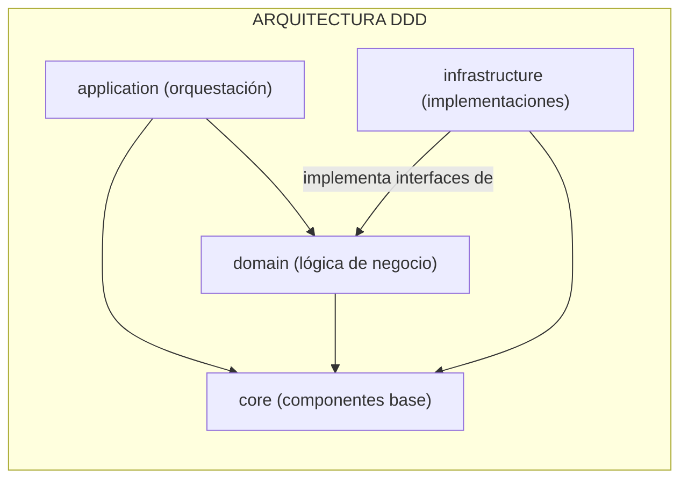

# V2M (VOICE2MACHINE)

### qué es esta carpeta
esta es la carpeta principal del paquete de `PYTHON` `v2m` contiene todo el código fuente que define la lógica y el comportamiento de la aplicación su estructura interna está organizada siguiendo una arquitectura por capas inspirada en el `diseño guiado por dominio (DDD)`

### para qué sirve
el propósito de esta organización es separar las responsabilidades del software en distintas capas lo que facilita su mantenimiento escalabilidad y testeo cada capa tiene un rol bien definido permitiendo que el sistema sea más modular y robusto

### qué puedo encontrar aquí
*   `application/` la capa de orquestación de casos de uso
*   `core/` la capa con los componentes base y transversales
*   `domain/` la capa que contiene la lógica de negocio pura
*   `infrastructure/` la capa con las implementaciones técnicas concretas
*   `main.py` el punto de entrada principal que inicializa y ejecuta la aplicación
*   `config.py` el módulo para cargar y gestionar la configuración

### arquitectura o diagramas
la arquitectura de la aplicación sigue el principio de dependencias hacia adentro (`clean architecture`) donde las capas externas dependen de las internas pero no al revés

*   el `domain` es el núcleo y no depende de nadie más que del `core`
*   la `application` depende del `domain` para ejecutar la lógica de negocio
*   la `infrastructure` depende del `domain` para implementar sus interfaces
*   todas las capas pueden depender del `core`

### cómo contribuir
1.  **identifica la capa correcta** antes de añadir código determina a qué capa pertenece
2.  **sigue los principios de dependencia** nunca hagas que una capa interna (eg `domain`) dependa de una externa (eg `infrastructure`)
3.  **usa inyección de dependencias** para desacoplar los componentes especialmente entre `application` e `infrastructure`

### faqs o preguntas frecuentes
*   **por qué usar una arquitectura tan compleja**
    *   esta arquitectura aunque requiere más archivos al principio paga dividendos a largo plazo al hacer el sistema más fácil de mantener probar y adaptar a nuevos requisitos
*   **dónde debo poner el código para una nueva API externa**
    *   la interfaz (el contrato) se definiría en el `domain` y la implementación concreta (el código que llama a la API) iría en la `infrastructure`

### referencias y recursos
*   `README.md` de cada subcarpeta para obtener una descripción detallada de cada capa
*   [artículo sobre diseño guiado por dominio (MARTIN FOWLER)](https://martinfowler.com/bliki/DomainDrivenDesign.html) para entender los conceptos fundamentales de DDD
