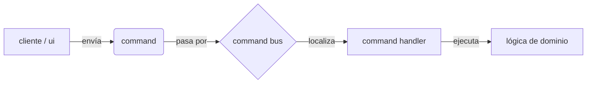

# CORE CQRS

### qué es esta carpeta
esta carpeta contiene la implementación del patrón **command query responsibility segregation (cqrs)** adaptado para el manejo de comandos en la aplicación define las estructuras base para enviar y procesar intenciones de usuario

### para qué sirve
su objetivo es desacoplar quien solicita una acción (el comando) de quien la ejecuta (el handler) esto permite:
*   una arquitectura más limpia y modular
*   facilidad para añadir nuevas funcionalidades sin modificar código existente
*   un punto central para interceptar y gestionar todas las operaciones (logging, métricas)

### qué puedo encontrar aquí
*   `command.py` define la clase base abstracta `Command` que todos los comandos deben heredar
*   `command_handler.py` define la interfaz genérica `CommandHandler` para los ejecutores de lógica
*   `command_bus.py` implementa el `CommandBus` que actúa como mediador recibiendo comandos y despachándolos al handler correcto

### arquitectura o diagramas
el flujo de ejecución sigue un camino unidireccional claro

1.  se instancia un `Command` (ej `StartRecordingCommand`)
2.  se pasa al `CommandBus`
3.  el bus busca en su registro qué `CommandHandler` sabe manejar ese comando
4.  el handler ejecuta la acción necesaria

### cómo contribuir
1.  **nuevos comandos** si añades una nueva funcionalidad crea un nuevo comando en la capa de aplicación que herede de `Command`
2.  **inmutabilidad** los comandos deben ser objetos de transferencia de datos (dto) inmutables solo deben transportar datos no lógica
3.  **registro** recuerda que para que un handler funcione debe ser registrado en el bus (normalmente en el contenedor de inyección de dependencias)

### faqs o preguntas frecuentes
*   **por qué no llamar a las funciones directamente**
    *   usar comandos nos permite encolarlos loguearlos o ejecutarlos asíncronamente en el futuro sin cambiar el código cliente además reduce el acoplamiento
*   **puedo tener múltiples handlers para un comando**
    *   en nuestra implementación actual no cada comando tiene exactamente un handler responsable de ejecutarlo

### referencias y recursos
*   [patrón cqrs en martin fowler](https://martinfowler.com/bliki/CQRS.html)
*   `src/v2m/application/commands.py` donde se definen los comandos concretos de la app
