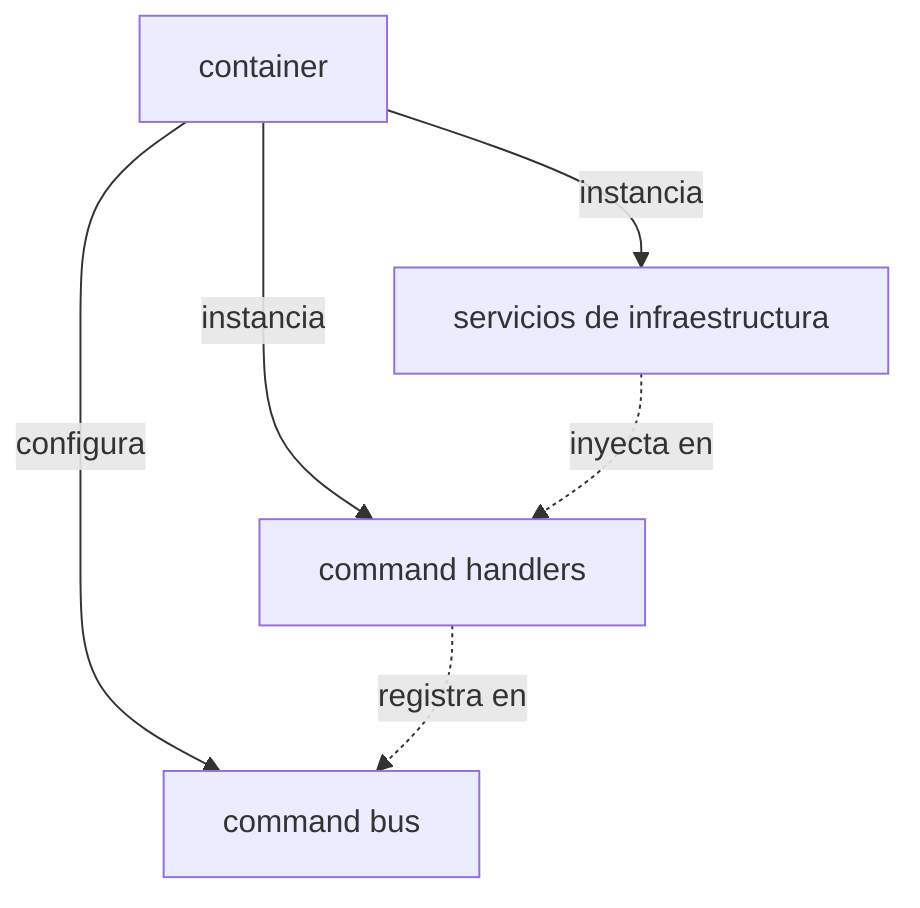

# CORE DI (DEPENDENCY INJECTION)

### qué es esta carpeta
esta carpeta aloja el **contenedor de inyección de dependencias** de la aplicación es el componente encargado de "cablear" todo el sistema instanciando objetos y resolviendo sus dependencias automáticamente

### para qué sirve
su propósito es centralizar la creación de objetos y la configuración de la arquitectura esto elimina la necesidad de que las clases creen sus propias dependencias (uso de `new`) promoviendo el principio de inversión de dependencias (solid dip)

### qué puedo encontrar aquí
*   `container.py` contiene la clase `Container` que actúa como el composition root de la aplicación aquí se definen qué implementaciones concretas se usarán para cada interfaz

### arquitectura o diagramas
el contenedor actúa como una fábrica centralizada

el contenedor asegura que:
1.  los servicios pesados (como modelos de ia) sean singletons (una sola instancia)
2.  los handlers reciban las instancias correctas de los servicios que necesitan
3.  el bus de comandos esté listo para usar al arrancar la app

### cómo contribuir
1.  **registrar nuevos servicios** si creas un nuevo servicio añádelo al método `__init__` del contenedor
2.  **cambiar implementaciones** si quieres cambiar una tecnología (ej cambiar de gemini a openai) solo necesitas modificar la instanciación en este archivo el resto de la app no se enterará
3.  **orden de carga** ten cuidado con el orden de instanciación si el servicio A depende del B el B debe crearse primero

### faqs o preguntas frecuentes
*   **por qué no usar un framework de di complejo**
    *   para el tamaño de este proyecto un contenedor manual ("pure di") es más simple explícito y fácil de depurar que frameworks basados en magia o decoradores
*   **cómo accedo al contenedor**
    *   el módulo exporta una instancia global `container` que ya está inicializada puedes importarla directamente donde la necesites (usualmente solo en `main.py` o puntos de entrada)

### referencias y recursos
*   [inyección de dependencias en python](https://python-dependency-injector.ets-labs.org/introduction/di_in_python.html)
*   `src/v2m/main.py` donde se utiliza el contenedor para arrancar la aplicación
