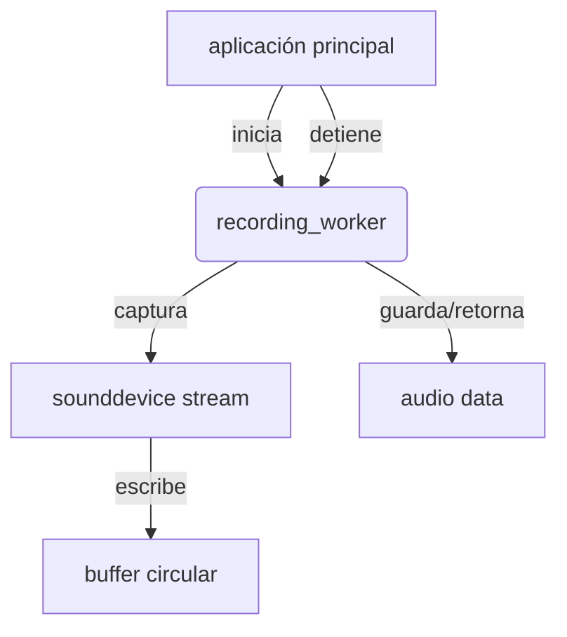

# INFRASTRUCTURE AUDIO

### qué es esta carpeta
esta carpeta contiene los componentes responsables de la captura y grabación de audio desde los dispositivos de entrada del sistema (micrófonos) es parte de la capa de infraestructura y maneja la interacción directa con el hardware de audio

### para qué sirve
su propósito principal es proporcionar una abstracción robusta y eficiente para grabar audio permitiendo:
*   iniciar y detener grabaciones bajo demanda
*   manejar buffers de audio en memoria (zero-copy cuando es posible)
*   aislar el proceso de grabación para evitar bloqueos en la aplicación principal

### qué puedo encontrar aquí
*   `recorder.py` contiene la clase `AudioRecorder` que implementa la lógica de grabación utilizando la librería `sounddevice`
*   `recording_worker.py` un script independiente diseñado para ejecutarse como un subproceso permitiendo que la grabación ocurra fuera del proceso principal de python (evitando problemas con el gil)

### arquitectura o diagramas
el sistema de grabación está diseñado para ser resiliente y de baja latencia

*   `AudioRecorder` maneja el stream de audio y el buffer
*   el uso de `numpy` asegura un manejo eficiente de la memoria para los datos de audio

### cómo contribuir
1.  **gestión de errores** asegúrate de manejar excepciones relacionadas con dispositivos de audio no disponibles o desconectados
2.  **eficiencia** el procesamiento de audio en tiempo real es sensible a la latencia evita operaciones bloqueantes en el hilo de grabación
3.  **compatibilidad** verifica que los cambios funcionen tanto en pulseaudio como en pipewire (estándares en linux moderno)

### faqs o preguntas frecuentes
*   **por qué un worker separado**
    *   python tiene un global interpreter lock (gil) que puede causar micro-pausas en la grabación si el hilo principal está ocupado procesando texto o red un proceso separado garantiza que el audio nunca se corte
*   **qué formato de audio se usa**
    *   internamente trabajamos con `float32` a 16khz mono que es el formato nativo esperado por el modelo whisper

### referencias y recursos
*   [documentación de sounddevice](https://python-sounddevice.readthedocs.io/)
*   `src/v2m/infrastructure/whisper_transcription_service.py` el consumidor principal de este componente
