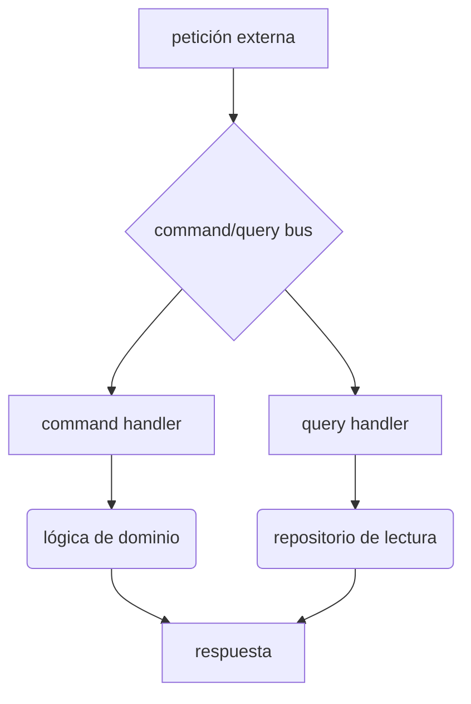

# APPLICATION

### ¿qué es esta carpeta?
esta carpeta corresponde a la `capa de aplicación` en nuestra arquitectura ddd. es la capa que define las acciones que el software puede realizar y orquesta la ejecución de estas acciones.

### ¿para qué sirve?
su función principal es coordinar los casos de uso de la aplicación. actúa como un intermediario entre la `infraestructura` (que recibe las peticiones del exterior) y el `dominio` (que contiene la lógica de negocio). esta capa no contiene lógica de negocio en sí misma, sino que utiliza los objetos y servicios del dominio para llevar a cabo las tareas.

### ¿qué puedo encontrar aquí?
*   `servicios de aplicación`: clases que exponen los casos de uso principales (e.g., `transcribir_audio_service`).
*   `comandos`: objetos que representan una intención de cambiar el estado del sistema (e.g., `iniciar_grabacion_command`).
*   `queries`: objetos que representan una solicitud de información sin modificar el estado (e.g., `obtener_ultima_transcripcion_query`).
*   `handlers`: manejadores que procesan los `comandos` y `queries`, interactuando con el `dominio` y la `infraestructura` a través de sus interfaces.

### arquitectura o diagramas
el flujo de una operación típica en esta capa sigue el patrón `cqrs` (separación de responsabilidades de comandos y consultas):

### cómo contribuir
1.  **define un comando o query**: crea una nueva clase para representar la acción o la consulta.
2.  **crea un handler**: implementa un manejador que reciba el comando/query.
3.  **orquesta la lógica**: dentro del handler, utiliza los repositorios y servicios del dominio para ejecutar la lógica de negocio. no implementes lógica de negocio aquí.
4.  **registra en el bus**: asegúrate de que el nuevo handler esté registrado en el `command bus` del `core`.

### faqs o preguntas frecuentes
*   **¿cuál es la diferencia entre un servicio de aplicación y un servicio de dominio?**
    *   un `servicio de aplicación` orquesta un caso de uso (e.g., procesar un pago), mientras que un `servicio de dominio` contiene lógica de negocio pura que no encaja en una entidad (e.g., calcular un impuesto complejo).
*   **¿puede esta capa acceder directamente a la base de datos?**
    *   no. debe hacerlo a través de las interfaces de repositorio definidas en el `dominio` y que son implementadas por la `infraestructura`.

### referencias y recursos
*   `src/whisper_dictation/domain/README.md`: para entender los objetos de negocio que esta capa orquesta.
*   `src/whisper_dictation/core/README.md`: para entender cómo funciona el `command bus`.
